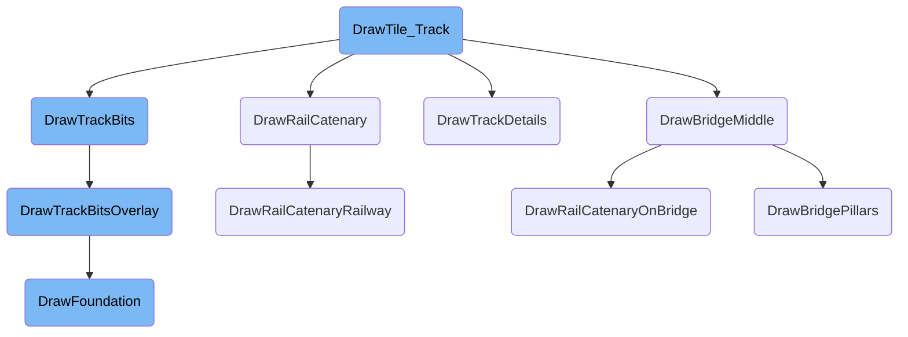

This document explains the process of drawing tracks in the game. It covers the steps involved in rendering different aspects of the track, such as the basic track bits, additional details, overhead wires for electric railways, and bridge components.

The process of drawing tracks involves several steps. First, the basic track is drawn, which includes the main rails. Then, additional details like fences are added if the full detail option is enabled. For electric railways, overhead wires are drawn. If the track is on a bridge, the middle sections and pillars of the bridge are also rendered. Each of these steps ensures that the track is visually complete and accurate in the game.

# Flow drill down



<SwmSnippet path="/src/rail_cmd.cpp" line="2422">

---

## Drawing the Track

The function <SwmToken path="src/rail_cmd.cpp" pos="2422:4:4" line-data="static void DrawTile_Track(TileInfo *ti)">`DrawTile_Track`</SwmToken> is responsible for drawing the track on a tile. It first sets the palette based on the tile owner and checks if the tile is a plain rail. If it is, it retrieves the track bits and calls <SwmToken path="src/rail_cmd.cpp" pos="2431:1:1" line-data="		DrawTrackBits(ti, rails);">`DrawTrackBits`</SwmToken> to render the track. If the display option for full detail is enabled, it calls <SwmToken path="src/rail_cmd.cpp" pos="2433:13:13" line-data="		if (HasBit(_display_opt, DO_FULL_DETAIL)) DrawTrackDetails(ti, rti);">`DrawTrackDetails`</SwmToken> to add additional details like fences. If the rail type has catenary, it calls <SwmToken path="src/rail_cmd.cpp" pos="2435:15:15" line-data="		if (HasRailCatenaryDrawn(GetRailType(ti-&gt;tile))) DrawRailCatenary(ti);">`DrawRailCatenary`</SwmToken> to draw the overhead wires. Finally, it checks for signals and draws them if present.

```c++
static void DrawTile_Track(TileInfo *ti)
{
	const RailTypeInfo *rti = GetRailTypeInfo(GetRailType(ti->tile));

	_drawtile_track_palette = COMPANY_SPRITE_COLOUR(GetTileOwner(ti->tile));

	if (IsPlainRail(ti->tile)) {
		TrackBits rails = GetTrackBits(ti->tile);

		DrawTrackBits(ti, rails);

		if (HasBit(_display_opt, DO_FULL_DETAIL)) DrawTrackDetails(ti, rti);

		if (HasRailCatenaryDrawn(GetRailType(ti->tile))) DrawRailCatenary(ti);

		if (HasSignals(ti->tile)) DrawSignals(ti->tile, rails, rti);
	} else {
		/* draw depot */
		const DrawTileSprites *dts;
		PaletteID pal = PAL_NONE;
		SpriteID relocation;
```

---

</SwmSnippet>

<SwmSnippet path="/src/rail_cmd.cpp" line="2237">

---

### Drawing Track Bits

The function <SwmToken path="src/rail_cmd.cpp" pos="2237:4:4" line-data="static void DrawTrackBits(TileInfo *ti, TrackBits track)">`DrawTrackBits`</SwmToken> is called to draw the individual track bits on the tile. It checks if the rail type uses an overlay and, if so, calls <SwmToken path="src/rail_cmd.cpp" pos="2242:1:1" line-data="		DrawTrackBitsOverlay(ti, track, rti);">`DrawTrackBitsOverlay`</SwmToken>. Otherwise, it proceeds to draw the foundation and the track bits.

```c++
static void DrawTrackBits(TileInfo *ti, TrackBits track)
{
	const RailTypeInfo *rti = GetRailTypeInfo(GetRailType(ti->tile));

	if (rti->UsesOverlay()) {
		DrawTrackBitsOverlay(ti, track, rti);
		return;
	}
```

---

</SwmSnippet>

<SwmSnippet path="/src/rail_cmd.cpp" line="2010">

---

### Drawing Track Details

The function <SwmToken path="src/rail_cmd.cpp" pos="2010:4:4" line-data="static void DrawTrackDetails(const TileInfo *ti, const RailTypeInfo *rti)">`DrawTrackDetails`</SwmToken> adds additional visual elements like fences to the track. It determines the base sprite for the fences and draws them based on the ground type of the rail.

```c++
static void DrawTrackDetails(const TileInfo *ti, const RailTypeInfo *rti)
{
	/* Base sprite for track fences.
	 * Note: Halftile slopes only have fences on the upper part. */
	uint num_sprites = 0;
	SpriteID base_image = GetCustomRailSprite(rti, ti->tile, RTSG_FENCES, IsHalftileSlope(ti->tileh) ? TCX_UPPER_HALFTILE : TCX_NORMAL, &num_sprites);
	if (base_image == 0) {
		base_image = SPR_TRACK_FENCE_FLAT_X;
		num_sprites = 8;
	}

	assert(num_sprites > 0);

	switch (GetRailGroundType(ti->tile)) {
		case RAIL_GROUND_FENCE_NW:     DrawTrackFence_NW(ti, base_image, num_sprites); break;
		case RAIL_GROUND_FENCE_SE:     DrawTrackFence_SE(ti, base_image, num_sprites); break;
		case RAIL_GROUND_FENCE_SENW:   DrawTrackFence_NW(ti, base_image, num_sprites);
		                               DrawTrackFence_SE(ti, base_image, num_sprites); break;
		case RAIL_GROUND_FENCE_NE:     DrawTrackFence_NE(ti, base_image, num_sprites); break;
		case RAIL_GROUND_FENCE_SW:     DrawTrackFence_SW(ti, base_image, num_sprites); break;
		case RAIL_GROUND_FENCE_NESW:   DrawTrackFence_NE(ti, base_image, num_sprites);
```

---

</SwmSnippet>

<SwmSnippet path="/src/elrail.cpp" line="568">

---

### Drawing Rail Catenary

The function <SwmToken path="src/elrail.cpp" pos="568:2:2" line-data="void DrawRailCatenary(const TileInfo *ti)">`DrawRailCatenary`</SwmToken> is responsible for drawing the overhead wires and pylons for electric railways. It checks the tile type and, if it is a railway, calls <SwmToken path="src/elrail.cpp" pos="278:4:4" line-data="static void DrawRailCatenaryRailway(const TileInfo *ti)">`DrawRailCatenaryRailway`</SwmToken> to render the catenary.

```c++
void DrawRailCatenary(const TileInfo *ti)
{
	switch (GetTileType(ti->tile)) {
		case MP_RAILWAY:
			if (IsRailDepot(ti->tile)) {
				const SortableSpriteStruct *sss = &RailCatenarySpriteData_Depot[GetRailDepotDirection(ti->tile)];

				SpriteID wire_base = GetWireBase(ti->tile);

				/* This wire is not visible with the default depot sprites */
				AddSortableSpriteToDraw(
					wire_base + sss->image_offset, PAL_NONE, ti->x + sss->x_offset, ti->y + sss->y_offset,
					sss->x_size, sss->y_size, sss->z_size,
					GetTileMaxPixelZ(ti->tile) + sss->z_offset,
					IsTransparencySet(TO_CATENARY)
				);
				return;
			}
			break;

		case MP_TUNNELBRIDGE:
```

---

</SwmSnippet>

<SwmSnippet path="/src/tunnelbridge_cmd.cpp" line="1541">

---

### Drawing Bridge Middle

The function <SwmToken path="src/tunnelbridge_cmd.cpp" pos="1541:2:2" line-data="void DrawBridgeMiddle(const TileInfo *ti)">`DrawBridgeMiddle`</SwmToken> handles the drawing of the middle sections of a bridge. It checks if the bridge is above the tile and then draws the floor, far part, and roof of the bridge. It also handles the drawing of rail catenary on the bridge if applicable.

```c++
void DrawBridgeMiddle(const TileInfo *ti)
{
	/* Sectional view of bridge bounding boxes:
	 *
	 *  1           2                                1,2 = SpriteCombine of Bridge front/(back&floor) and RoadCatenary
	 *  1           2                                  3 = empty helper BB
	 *  1     7     2                                4,5 = pillars under higher bridges
	 *  1 6 88888 6 2                                  6 = elrail-pylons
	 *  1 6 88888 6 2                                  7 = elrail-wire
	 *  1 6 88888 6 2  <- TILE_HEIGHT                  8 = rail-vehicle on bridge
	 *  3333333333333  <- BB_Z_SEPARATOR
	 *                 <- unused
	 *    4       5    <- BB_HEIGHT_UNDER_BRIDGE
	 *    4       5
	 *    4       5
	 *
	 */

	if (!IsBridgeAbove(ti->tile)) return;

	TileIndex rampnorth = GetNorthernBridgeEnd(ti->tile);
```

---

</SwmSnippet>

<SwmSnippet path="/src/tunnelbridge_cmd.cpp" line="1074">

---

### Drawing Bridge Pillars

The function <SwmToken path="src/tunnelbridge_cmd.cpp" pos="1074:4:4" line-data="static void DrawBridgePillars(const PalSpriteID *psid, const TileInfo *ti, Axis axis, bool drawfarpillar, int x, int y, int z_bridge)">`DrawBridgePillars`</SwmToken> draws the pillars under high bridges. It calculates the height of the pillars based on the ground height and draws both the front and back pillars.

```c++
static void DrawBridgePillars(const PalSpriteID *psid, const TileInfo *ti, Axis axis, bool drawfarpillar, int x, int y, int z_bridge)
{
	static const int bounding_box_size[2]  = {16, 2}; ///< bounding box size of pillars along bridge direction
	static const int back_pillar_offset[2] = { 0, 9}; ///< sprite position offset of back facing pillar

	static const int INF = 1000; ///< big number compared to sprite size
	static const SubSprite half_pillar_sub_sprite[2][2] = {
		{ {  -14, -INF, INF, INF }, { -INF, -INF, -15, INF } }, // X axis, north and south
		{ { -INF, -INF,  15, INF }, {   16, -INF, INF, INF } }, // Y axis, north and south
	};

	if (psid->sprite == 0) return;

	/* Determine ground height under pillars */
	DiagDirection south_dir = AxisToDiagDir(axis);
	int z_front_north = ti->z;
	int z_back_north = ti->z;
	int z_front_south = ti->z;
	int z_back_south = ti->z;
	GetSlopePixelZOnEdge(ti->tileh, south_dir, z_front_south, z_back_south);
	GetSlopePixelZOnEdge(ti->tileh, ReverseDiagDir(south_dir), z_front_north, z_back_north);
```

---

</SwmSnippet>

<SwmSnippet path="/src/landscape.cpp" line="425">

---

### Drawing Foundation

The function <SwmToken path="src/landscape.cpp" pos="425:2:2" line-data="void DrawFoundation(TileInfo *ti, Foundation f)">`DrawFoundation`</SwmToken> draws the foundation for a tile. It selects the appropriate foundation sprite based on the slope and height of the tile and draws it.

```c++
void DrawFoundation(TileInfo *ti, Foundation f)
{
	if (!IsFoundation(f)) return;

	/* Two part foundations must be drawn separately */
	assert(f != FOUNDATION_STEEP_BOTH);

	uint sprite_block = 0;
	auto [slope, z] = GetFoundationPixelSlope(ti->tile);

	/* Select the needed block of foundations sprites
	 * Block 0: Walls at NW and NE edge
	 * Block 1: Wall  at        NE edge
	 * Block 2: Wall  at NW        edge
	 * Block 3: No walls at NW or NE edge
	 */
	if (!HasFoundationNW(ti->tile, slope, z)) sprite_block += 1;
	if (!HasFoundationNE(ti->tile, slope, z)) sprite_block += 2;

	/* Use the original slope sprites if NW and NE borders should be visible */
	SpriteID leveled_base = (sprite_block == 0 ? (int)SPR_FOUNDATION_BASE : (SPR_SLOPES_VIRTUAL_BASE + sprite_block * SPR_TRKFOUND_BLOCK_SIZE));
```

---

</SwmSnippet>

&nbsp;

*This is an auto-generated document by Swimm AI 🌊 and has not yet been verified by a human*

<SwmMeta version="3.0.0" repo-id="Z2l0aHViJTNBJTNBT3BlblRURC1jb3BpbG90LWRlbW8lM0ElM0Fzd2ltbWlv" repo-name="OpenTTD-copilot-demo"><sup>Powered by [Swimm](/)</sup></SwmMeta>
