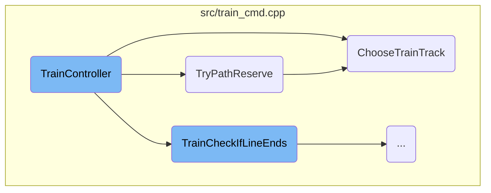
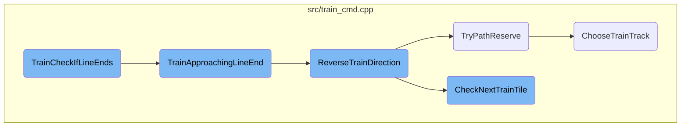
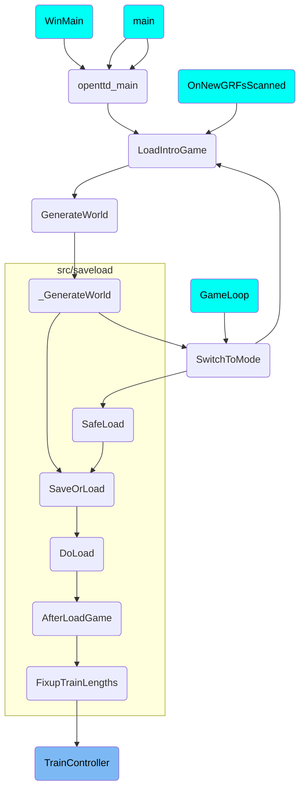

In this document, we will explain the role and functionality of the <SwmToken path="src/train_cmd.cpp" pos="3283:2:2" line-data="bool TrainController(Train *v, Vehicle *nomove, bool reverse)">`TrainController`</SwmToken> and its associated functions. The <SwmToken path="src/train_cmd.cpp" pos="3283:2:2" line-data="bool TrainController(Train *v, Vehicle *nomove, bool reverse)">`TrainController`</SwmToken> is responsible for managing the movement and behavior of trains within the game, ensuring they follow the correct tracks, handle signals, and navigate various scenarios such as reversing direction or stopping at stations.

The <SwmToken path="src/train_cmd.cpp" pos="3283:2:2" line-data="bool TrainController(Train *v, Vehicle *nomove, bool reverse)">`TrainController`</SwmToken> function is like the brain of the train, telling it how to move forward one step at a time. It checks if the train needs to stay on the same track, move to a new one, or deal with signals and crossings. If the train reaches the end of a track or a red signal, it might need to reverse direction. The <SwmToken path="src/train_cmd.cpp" pos="2871:2:2" line-data="bool TryPathReserve(Train *v, bool mark_as_stuck, bool first_tile_okay)">`TryPathReserve`</SwmToken> function helps the train find a clear path to move forward without bumping into other trains. The <SwmToken path="src/train_cmd.cpp" pos="2699:4:4" line-data="static Track ChooseTrainTrack(Train *v, TileIndex tile, DiagDirection enterdir, TrackBits tracks, bool force_res, bool *got_reservation, bool mark_stuck)">`ChooseTrainTrack`</SwmToken> function decides the best track for the train to follow, avoiding collisions. If the train is getting close to the end of a track, the <SwmToken path="src/train_cmd.cpp" pos="3792:4:4" line-data="static bool TrainApproachingLineEnd(Train *v, bool signal, bool reverse)">`TrainApproachingLineEnd`</SwmToken> function makes sure it slows down or reverses to stay safe. The <SwmToken path="src/train_cmd.cpp" pos="1967:2:2" line-data="void ReverseTrainDirection(Train *v)">`ReverseTrainDirection`</SwmToken> function turns the train around when needed, and the <SwmToken path="src/train_cmd.cpp" pos="2206:4:4" line-data="static void CheckNextTrainTile(Train *v)">`CheckNextTrainTile`</SwmToken> function ensures the train can continue its journey smoothly by reserving the next part of the track.

Here is a high level diagram of the flow, showing only the most important functions:

```mermaid
graph TD;
      subgraph srctraincmdcpp["src/train_cmd.cpp"]
1ea7f8974fe828f1e0d9b36c33596bee9c84cb0ffe3fe96333e169f4e2b40a54(TrainController):::mainFlowStyle --> 245d9cdfe1edd734e2a0b9b82e5591dd92803ce09d0f846b88613efd8d4ce608(TryPathReserve)
end

subgraph srctraincmdcpp["src/train_cmd.cpp"]
1ea7f8974fe828f1e0d9b36c33596bee9c84cb0ffe3fe96333e169f4e2b40a54(TrainController):::mainFlowStyle --> c0b7bb6e07426afba097a26b7fe786d9d4baef40529c17aa0da7b6d8e3fa7d20(ChooseTrainTrack)
end

subgraph srctraincmdcpp["src/train_cmd.cpp"]
1ea7f8974fe828f1e0d9b36c33596bee9c84cb0ffe3fe96333e169f4e2b40a54(TrainController):::mainFlowStyle --> 96a18e9cd874b378a28bc2fdf619bb0a5c346f6524a29ed09d32b611925b9741(TrainCheckIfLineEnds):::mainFlowStyle
end

subgraph srctraincmdcpp["src/train_cmd.cpp"]
96a18e9cd874b378a28bc2fdf619bb0a5c346f6524a29ed09d32b611925b9741(TrainCheckIfLineEnds):::mainFlowStyle --> 1ba11dafc3878eb05f064dfdccb23acd335d8274d2dfcbfbd70a82097626dcc5(TrainApproachingLineEnd):::mainFlowStyle
end

subgraph srctraincmdcpp["src/train_cmd.cpp"]
1ba11dafc3878eb05f064dfdccb23acd335d8274d2dfcbfbd70a82097626dcc5(TrainApproachingLineEnd):::mainFlowStyle --> c9a6a5dd7f648578eaf2bb601f3f97e104e2c6cc03b7676685d4f9fbfa597cbe(ReverseTrainDirection):::mainFlowStyle
end

subgraph srctraincmdcpp["src/train_cmd.cpp"]
c9a6a5dd7f648578eaf2bb601f3f97e104e2c6cc03b7676685d4f9fbfa597cbe(ReverseTrainDirection):::mainFlowStyle --> 245d9cdfe1edd734e2a0b9b82e5591dd92803ce09d0f846b88613efd8d4ce608(TryPathReserve)
end

subgraph srctraincmdcpp["src/train_cmd.cpp"]
c9a6a5dd7f648578eaf2bb601f3f97e104e2c6cc03b7676685d4f9fbfa597cbe(ReverseTrainDirection):::mainFlowStyle --> 826c1e10f077f562d32ccaeb62a0c4395a32e5039d527cc2bd14f0f4bb45bec2(CheckNextTrainTile):::mainFlowStyle
end

subgraph srctraincmdcpp["src/train_cmd.cpp"]
826c1e10f077f562d32ccaeb62a0c4395a32e5039d527cc2bd14f0f4bb45bec2(CheckNextTrainTile):::mainFlowStyle --> c0b7bb6e07426afba097a26b7fe786d9d4baef40529c17aa0da7b6d8e3fa7d20(ChooseTrainTrack)
end


      classDef mainFlowStyle color:#000000,fill:#7CB9F4
classDef rootsStyle color:#000000,fill:#00FFF4
classDef Style1 color:#000000,fill:#00FFAA
classDef Style2 color:#000000,fill:#FFFF00
classDef Style3 color:#000000,fill:#AA7CB9
```



# Flow drill down

First, we'll zoom into this section of the flow:



<SwmSnippet path="/src/train_cmd.cpp" line="3283">

---

## <SwmToken path="src/train_cmd.cpp" pos="3283:2:2" line-data="bool TrainController(Train *v, Vehicle *nomove, bool reverse)">`TrainController`</SwmToken>

The <SwmToken path="src/train_cmd.cpp" pos="3283:2:2" line-data="bool TrainController(Train *v, Vehicle *nomove, bool reverse)">`TrainController`</SwmToken> function is responsible for moving a train forward by one movement stop. It handles various scenarios such as staying in the same tile, entering a new tile, and dealing with signals and crossings. The function ensures that the train follows the correct track and updates its position accordingly. It also checks if the train needs to reverse direction or stop at a station.

```c++
bool TrainController(Train *v, Vehicle *nomove, bool reverse)
{
	Train *first = v->First();
	Train *prev;
	bool direction_changed = false; // has direction of any part changed?

	/* For every vehicle after and including the given vehicle */
	for (prev = v->Previous(); v != nomove; prev = v, v = v->Next()) {
		DiagDirection enterdir = DIAGDIR_BEGIN;
		bool update_signals_crossing = false; // will we update signals or crossing state?

		GetNewVehiclePosResult gp = GetNewVehiclePos(v);
		if (v->track != TRACK_BIT_WORMHOLE) {
			/* Not inside tunnel */
			if (gp.old_tile == gp.new_tile) {
				/* Staying in the old tile */
				if (v->track == TRACK_BIT_DEPOT) {
					/* Inside depot */
					gp.x = v->x_pos;
					gp.y = v->y_pos;
				} else {
```

---

</SwmSnippet>

<SwmSnippet path="/src/train_cmd.cpp" line="2871">

---

## <SwmToken path="src/train_cmd.cpp" pos="2871:2:2" line-data="bool TryPathReserve(Train *v, bool mark_as_stuck, bool first_tile_okay)">`TryPathReserve`</SwmToken>

The <SwmToken path="src/train_cmd.cpp" pos="2871:2:2" line-data="bool TryPathReserve(Train *v, bool mark_as_stuck, bool first_tile_okay)">`TryPathReserve`</SwmToken> function attempts to reserve a path for the train to a safe position. It handles special cases like depots and checks if the path is already blocked by another train. If a path can be reserved, it updates the train's status and clears any 'stuck' flags. This function ensures that the train can move forward without conflicts.

```c++
bool TryPathReserve(Train *v, bool mark_as_stuck, bool first_tile_okay)
{
	assert(v->IsFrontEngine());

	/* We have to handle depots specially as the track follower won't look
	 * at the depot tile itself but starts from the next tile. If we are still
	 * inside the depot, a depot reservation can never be ours. */
	if (v->track == TRACK_BIT_DEPOT) {
		if (HasDepotReservation(v->tile)) {
			if (mark_as_stuck) MarkTrainAsStuck(v);
			return false;
		} else {
			/* Depot not reserved, but the next tile might be. */
			TileIndex next_tile = TileAddByDiagDir(v->tile, GetRailDepotDirection(v->tile));
			if (HasReservedTracks(next_tile, DiagdirReachesTracks(GetRailDepotDirection(v->tile)))) return false;
		}
	}

	Vehicle *other_train = nullptr;
	PBSTileInfo origin = FollowTrainReservation(v, &other_train);
	/* The path we are driving on is already blocked by some other train.
```

---

</SwmSnippet>

<SwmSnippet path="/src/train_cmd.cpp" line="2699">

---

## <SwmToken path="src/train_cmd.cpp" pos="2699:4:4" line-data="static Track ChooseTrainTrack(Train *v, TileIndex tile, DiagDirection enterdir, TrackBits tracks, bool force_res, bool *got_reservation, bool mark_stuck)">`ChooseTrainTrack`</SwmToken>

The <SwmToken path="src/train_cmd.cpp" pos="2699:4:4" line-data="static Track ChooseTrainTrack(Train *v, TileIndex tile, DiagDirection enterdir, TrackBits tracks, bool force_res, bool *got_reservation, bool mark_stuck)">`ChooseTrainTrack`</SwmToken> function selects the best track for the train to follow based on the current tile and direction. It considers reserved tracks, signals, and the train's orders. If a path reservation is required, it extends the reservation to ensure the train can reach a safe position. This function is crucial for determining the train's route and avoiding collisions.

```c++
static Track ChooseTrainTrack(Train *v, TileIndex tile, DiagDirection enterdir, TrackBits tracks, bool force_res, bool *got_reservation, bool mark_stuck)
{
	Track best_track = INVALID_TRACK;
	bool do_track_reservation = _settings_game.pf.reserve_paths || force_res;
	bool changed_signal = false;
	TileIndex final_dest = INVALID_TILE;

	assert((tracks & ~TRACK_BIT_MASK) == 0);

	if (got_reservation != nullptr) *got_reservation = false;

	/* Don't use tracks here as the setting to forbid 90 deg turns might have been switched between reservation and now. */
	TrackBits res_tracks = (TrackBits)(GetReservedTrackbits(tile) & DiagdirReachesTracks(enterdir));
	/* Do we have a suitable reserved track? */
	if (res_tracks != TRACK_BIT_NONE) return FindFirstTrack(res_tracks);

	/* Quick return in case only one possible track is available */
	if (KillFirstBit(tracks) == TRACK_BIT_NONE) {
		Track track = FindFirstTrack(tracks);
		/* We need to check for signals only here, as a junction tile can't have signals. */
		if (track != INVALID_TRACK && HasPbsSignalOnTrackdir(tile, TrackEnterdirToTrackdir(track, enterdir))) {
```

---

</SwmSnippet>

Now, lets zoom into this section of the flow:



<SwmSnippet path="/src/train_cmd.cpp" line="3784">

---

## Handling Train Approaching Line End

The function <SwmToken path="src/train_cmd.cpp" pos="3792:4:4" line-data="static bool TrainApproachingLineEnd(Train *v, bool signal, bool reverse)">`TrainApproachingLineEnd`</SwmToken> is responsible for managing the train's behavior when it is approaching the end of a track or a red signal. It calculates the train's position within the current tile and determines whether the train needs to slow down or reverse. If the train is too close to the tile boundary, it will reverse direction to avoid crossing the boundary. This ensures that the train does not proceed into an invalid or unsafe track segment.

```c++
/**
 * Train is approaching line end, slow down and possibly reverse
 *
 * @param v front train engine
 * @param signal not line end, just a red signal
 * @param reverse Set to false to not execute the vehicle reversing. This does not change any other logic.
 * @return true iff we did NOT have to reverse
 */
static bool TrainApproachingLineEnd(Train *v, bool signal, bool reverse)
{
	/* Calc position within the current tile */
	uint x = v->x_pos & 0xF;
	uint y = v->y_pos & 0xF;

	/* for diagonal directions, 'x' will be 0..15 -
	 * for other directions, it will be 1, 3, 5, ..., 15 */
	switch (v->direction) {
		case DIR_N : x = ~x + ~y + 25; break;
		case DIR_NW: x = y;            [[fallthrough]];
		case DIR_NE: x = ~x + 16;      break;
		case DIR_E : x = ~x + y + 9;   break;
```

---

</SwmSnippet>

<SwmSnippet path="/src/train_cmd.cpp" line="1963">

---

## Reversing Train Direction

The function <SwmToken path="src/train_cmd.cpp" pos="1967:2:2" line-data="void ReverseTrainDirection(Train *v)">`ReverseTrainDirection`</SwmToken> handles the logic for turning the train around when it reaches the end of a track. This includes clearing any path reservations, swapping the positions of the train's wagons, and updating the train's direction and visual representation. It also ensures that the train's new direction is valid and updates any level crossings that the train might be approaching.

```c++
/**
 * Turn a train around.
 * @param v %Train to turn around.
 */
void ReverseTrainDirection(Train *v)
{
	if (IsRailDepotTile(v->tile)) {
		if (IsWholeTrainInsideDepot(v)) return;
		InvalidateWindowData(WC_VEHICLE_DEPOT, v->tile);
	}

	/* Clear path reservation in front if train is not stuck. */
	if (!HasBit(v->flags, VRF_TRAIN_STUCK)) FreeTrainTrackReservation(v);

	/* Check if we were approaching a rail/road-crossing */
	TileIndex crossing = TrainApproachingCrossingTile(v);

	/* count number of vehicles */
	int r = CountVehiclesInChain(v) - 1;  // number of vehicles - 1

	AdvanceWagonsBeforeSwap(v);
```

---

</SwmSnippet>

<SwmSnippet path="/src/train_cmd.cpp" line="3887">

---

## Checking If Line Ends

The function <SwmToken path="src/train_cmd.cpp" pos="3894:4:4" line-data="static bool TrainCheckIfLineEnds(Train *v, bool reverse)">`TrainCheckIfLineEnds`</SwmToken> checks if the train is at the end of a line. It handles scenarios such as broken-down trains, determining the next tile, and checking the track status on the next tile. If the train is approaching a red signal or an unusable track, it calls <SwmToken path="src/train_cmd.cpp" pos="3792:4:4" line-data="static bool TrainApproachingLineEnd(Train *v, bool signal, bool reverse)">`TrainApproachingLineEnd`</SwmToken> to manage the train's behavior accordingly.

```c++
/**
 * Checks for line end. Also, bars crossing at next tile if needed
 *
 * @param v vehicle we are checking
 * @param reverse Set to false to not execute the vehicle reversing. This does not change any other logic.
 * @return true iff we did NOT have to reverse
 */
static bool TrainCheckIfLineEnds(Train *v, bool reverse)
{
	/* First, handle broken down train */

	int t = v->breakdown_ctr;
	if (t > 1) {
		v->vehstatus |= VS_TRAIN_SLOWING;

		uint16_t break_speed = _breakdown_speeds[GB(~t, 4, 4)];
		if (break_speed < v->cur_speed) v->cur_speed = break_speed;
	} else {
		v->vehstatus &= ~VS_TRAIN_SLOWING;
	}

```

---

</SwmSnippet>

<SwmSnippet path="/src/train_cmd.cpp" line="2202">

---

## Checking Next Train Tile

The function <SwmToken path="src/train_cmd.cpp" pos="2206:4:4" line-data="static void CheckNextTrainTile(Train *v)">`CheckNextTrainTile`</SwmToken> is responsible for extending the train's path reservation if it is on the last reserved tile. It checks various conditions such as the train's current order, the presence of signals, and whether the next tile is reserved. If the next tile is not reserved, it attempts to make a new reservation to ensure the train can continue its journey smoothly.

```c++
/**
 * Check if the train is on the last reserved tile and try to extend the path then.
 * @param v %Train that needs its path extended.
 */
static void CheckNextTrainTile(Train *v)
{
	/* Don't do any look-ahead if path_backoff_interval is 255. */
	if (_settings_game.pf.path_backoff_interval == 255) return;

	/* Exit if we are inside a depot. */
	if (v->track == TRACK_BIT_DEPOT) return;

	switch (v->current_order.GetType()) {
		/* Exit if we reached our destination depot. */
		case OT_GOTO_DEPOT:
			if (v->tile == v->dest_tile) return;
			break;

		case OT_GOTO_WAYPOINT:
			/* If we reached our waypoint, make sure we see that. */
			if (IsRailWaypointTile(v->tile) && GetStationIndex(v->tile) == v->current_order.GetDestination()) ProcessOrders(v);
```

---

</SwmSnippet>

# Where is this flow used?

This flow is used multiple times in the codebase as represented in the following diagram:

(Note - these are only some of the entry points of this flow)



&nbsp;

*This is an auto-generated document by Swimm AI 🌊 and has not yet been verified by a human*

<SwmMeta version="3.0.0" repo-id="Z2l0aHViJTNBJTNBT3BlblRURC1jb3BpbG90LWRlbW8lM0ElM0Fzd2ltbWlv" repo-name="OpenTTD-copilot-demo"><sup>Powered by [Swimm](/)</sup></SwmMeta>
