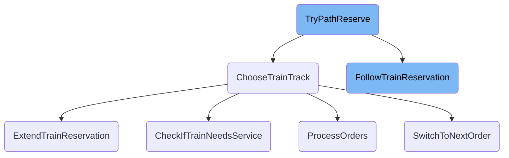
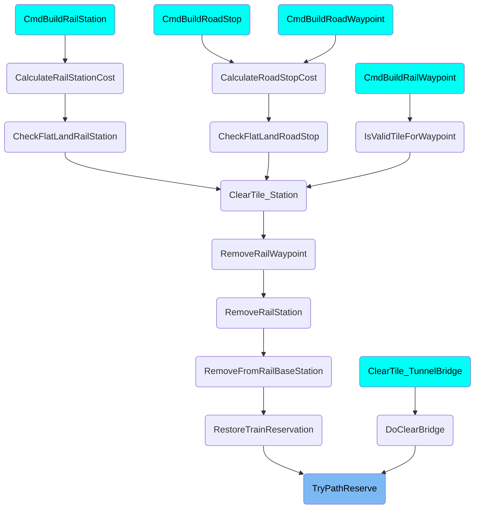

This document explains the process of reserving a path for a train to ensure it reaches a safe position. The process involves checking if the train is in a depot, following the current reservation, handling blocked paths, and choosing the next track.

The flow starts by checking if the train is in a depot and handling depot reservations. It then follows the train's current reservation to see if the path is clear. If the path is blocked by another train, the train is marked as stuck. If the path is clear, the next track is chosen for the train to follow. This ensures that the train can safely reach its destination without collisions or getting stuck.

# Flow drill down



<SwmSnippet path="/src/train_cmd.cpp" line="2863">

---

## <SwmToken path="src/train_cmd.cpp" pos="2871:2:2" line-data="bool TryPathReserve(Train *v, bool mark_as_stuck, bool first_tile_okay)">`TryPathReserve`</SwmToken>

The <SwmToken path="src/train_cmd.cpp" pos="2871:2:2" line-data="bool TryPathReserve(Train *v, bool mark_as_stuck, bool first_tile_okay)">`TryPathReserve`</SwmToken> function attempts to reserve a path for a train to a safe position. It first checks if the train is in a depot and handles depot reservations. It then follows the train's current reservation using <SwmToken path="src/train_cmd.cpp" pos="2487:7:7" line-data="	PBSTileInfo origin = FollowTrainReservation(v);">`FollowTrainReservation`</SwmToken>. If the path is blocked by another train, it marks the train as stuck and exits. If the path is clear, it proceeds to choose the next track using <SwmToken path="src/train_cmd.cpp" pos="2699:4:4" line-data="static Track ChooseTrainTrack(Train *v, TileIndex tile, DiagDirection enterdir, TrackBits tracks, bool force_res, bool *got_reservation, bool mark_stuck)">`ChooseTrainTrack`</SwmToken>.

```c++
/**
 * Try to reserve a path to a safe position.
 *
 * @param v The vehicle
 * @param mark_as_stuck Should the train be marked as stuck on a failed reservation?
 * @param first_tile_okay True if no path should be reserved if the current tile is a safe position.
 * @return True if a path could be reserved.
 */
bool TryPathReserve(Train *v, bool mark_as_stuck, bool first_tile_okay)
{
	assert(v->IsFrontEngine());

	/* We have to handle depots specially as the track follower won't look
	 * at the depot tile itself but starts from the next tile. If we are still
	 * inside the depot, a depot reservation can never be ours. */
	if (v->track == TRACK_BIT_DEPOT) {
		if (HasDepotReservation(v->tile)) {
			if (mark_as_stuck) MarkTrainAsStuck(v);
			return false;
		} else {
			/* Depot not reserved, but the next tile might be. */
```

---

</SwmSnippet>

<SwmSnippet path="/src/train_cmd.cpp" line="2698">

---

## <SwmToken path="src/train_cmd.cpp" pos="2699:4:4" line-data="static Track ChooseTrainTrack(Train *v, TileIndex tile, DiagDirection enterdir, TrackBits tracks, bool force_res, bool *got_reservation, bool mark_stuck)">`ChooseTrainTrack`</SwmToken>

The <SwmToken path="src/train_cmd.cpp" pos="2699:4:4" line-data="static Track ChooseTrainTrack(Train *v, TileIndex tile, DiagDirection enterdir, TrackBits tracks, bool force_res, bool *got_reservation, bool mark_stuck)">`ChooseTrainTrack`</SwmToken> function selects the best track for the train to follow. It checks for reserved tracks and signals, and if necessary, extends the reservation using <SwmToken path="src/train_cmd.cpp" pos="2485:4:4" line-data="static PBSTileInfo ExtendTrainReservation(const Train *v, TrackBits *new_tracks, DiagDirection *enterdir)">`ExtendTrainReservation`</SwmToken>. It also handles special cases like checking if the train needs service and processing orders. If a valid reservation is made, it updates the train's path and marks the track as reserved.

```c++
/* choose a track */
static Track ChooseTrainTrack(Train *v, TileIndex tile, DiagDirection enterdir, TrackBits tracks, bool force_res, bool *got_reservation, bool mark_stuck)
{
	Track best_track = INVALID_TRACK;
	bool do_track_reservation = _settings_game.pf.reserve_paths || force_res;
	bool changed_signal = false;
	TileIndex final_dest = INVALID_TILE;

	assert((tracks & ~TRACK_BIT_MASK) == 0);

	if (got_reservation != nullptr) *got_reservation = false;

	/* Don't use tracks here as the setting to forbid 90 deg turns might have been switched between reservation and now. */
	TrackBits res_tracks = (TrackBits)(GetReservedTrackbits(tile) & DiagdirReachesTracks(enterdir));
	/* Do we have a suitable reserved track? */
	if (res_tracks != TRACK_BIT_NONE) return FindFirstTrack(res_tracks);

	/* Quick return in case only one possible track is available */
	if (KillFirstBit(tracks) == TRACK_BIT_NONE) {
		Track track = FindFirstTrack(tracks);
		/* We need to check for signals only here, as a junction tile can't have signals. */
```

---

</SwmSnippet>

<SwmSnippet path="/src/train_cmd.cpp" line="2480">

---

### Extending the Reservation

The <SwmToken path="src/train_cmd.cpp" pos="2485:4:4" line-data="static PBSTileInfo ExtendTrainReservation(const Train *v, TrackBits *new_tracks, DiagDirection *enterdir)">`ExtendTrainReservation`</SwmToken> function extends the train's path as far as possible until it encounters a safe tile, another reservation, or a track choice. It follows the train's current path and attempts to reserve each tile. If it encounters a signal, it may change the signal state to red. If a safe waiting position is found, it marks the path as valid and okay.

```c++
/**
 * Extend a train path as far as possible. Stops on encountering a safe tile,
 * another reservation or a track choice.
 * @return INVALID_TILE indicates that the reservation failed.
 */
static PBSTileInfo ExtendTrainReservation(const Train *v, TrackBits *new_tracks, DiagDirection *enterdir)
{
	PBSTileInfo origin = FollowTrainReservation(v);

	CFollowTrackRail ft(v);

	std::vector<std::pair<TileIndex, Trackdir>> signals_set_to_red;

	TileIndex tile = origin.tile;
	Trackdir  cur_td = origin.trackdir;
	while (ft.Follow(tile, cur_td)) {
		if (KillFirstBit(ft.m_new_td_bits) == TRACKDIR_BIT_NONE) {
			/* Possible signal tile. */
			if (HasOnewaySignalBlockingTrackdir(ft.m_new_tile, FindFirstTrackdir(ft.m_new_td_bits))) break;
		}

```

---

</SwmSnippet>

<SwmSnippet path="/src/pbs.cpp" line="281">

---

### Following the Reservation

The <SwmToken path="src/pbs.cpp" pos="288:2:2" line-data="PBSTileInfo FollowTrainReservation(const Train *v, Vehicle **train_on_res)">`FollowTrainReservation`</SwmToken> function follows the train's current reservation to the last tile. It checks for any trains on the reserved path and ensures the path ends at a safe waiting position. If another train is encountered, it updates the <SwmToken path="src/pbs.cpp" pos="285:6:6" line-data=" * @param train_on_res Is set to a train we might encounter">`train_on_res`</SwmToken> parameter.

```c++
/**
 * Follow a train reservation to the last tile.
 *
 * @param v the vehicle
 * @param train_on_res Is set to a train we might encounter
 * @returns The last tile of the reservation or the current train tile if no reservation present.
 */
PBSTileInfo FollowTrainReservation(const Train *v, Vehicle **train_on_res)
{
	assert(v->type == VEH_TRAIN);

	TileIndex tile = v->tile;
	Trackdir  trackdir = v->GetVehicleTrackdir();

	if (IsRailDepotTile(tile) && !GetDepotReservationTrackBits(tile)) return PBSTileInfo(tile, trackdir, false);

	FindTrainOnTrackInfo ftoti;
	ftoti.res = FollowReservation(v->owner, GetRailTypeInfo(v->railtype)->compatible_railtypes, tile, trackdir);
	ftoti.res.okay = IsSafeWaitingPosition(v, ftoti.res.tile, ftoti.res.trackdir, true, _settings_game.pf.forbid_90_deg);
	if (train_on_res != nullptr) {
		FindVehicleOnPos(ftoti.res.tile, &ftoti, FindTrainOnTrackEnum);
```

---

</SwmSnippet>

<SwmSnippet path="/src/train_cmd.cpp" line="4139">

---

### Checking for Service Needs

The <SwmToken path="src/train_cmd.cpp" pos="4143:4:4" line-data="static void CheckIfTrainNeedsService(Train *v)">`CheckIfTrainNeedsService`</SwmToken> function checks if the train requires servicing. If the train needs service, it finds the nearest depot and updates the train's orders to go to the depot. This ensures that trains are maintained and reduces the likelihood of breakdowns.

```c++
/**
 * Check whether a train needs service, and if so, find a depot or service it.
 * @return v %Train to check.
 */
static void CheckIfTrainNeedsService(Train *v)
{
	if (Company::Get(v->owner)->settings.vehicle.servint_trains == 0 || !v->NeedsAutomaticServicing()) return;
	if (v->IsChainInDepot()) {
		VehicleServiceInDepot(v);
		return;
	}

	uint max_penalty = _settings_game.pf.yapf.maximum_go_to_depot_penalty;

	FindDepotData tfdd = FindClosestTrainDepot(v, max_penalty);
	/* Only go to the depot if it is not too far out of our way. */
	if (tfdd.best_length == UINT_MAX || tfdd.best_length > max_penalty) {
		if (v->current_order.IsType(OT_GOTO_DEPOT)) {
			/* If we were already heading for a depot but it has
			 * suddenly moved farther away, we continue our normal
			 * schedule? */
```

---

</SwmSnippet>

<SwmSnippet path="/src/order_cmd.cpp" line="2120">

---

### Processing Orders

The <SwmToken path="src/order_cmd.cpp" pos="2127:2:2" line-data="bool ProcessOrders(Vehicle *v)">`ProcessOrders`</SwmToken> function handles the train's orders and determines the next destination. It checks the type of the current order and updates the train's destination accordingly. This function ensures that trains follow their schedules and reach their intended destinations.

```c++
/**
 * Handle the orders of a vehicle and determine the next place
 * to go to if needed.
 * @param v the vehicle to do this for.
 * @return true *if* the vehicle is eligible for reversing
 *              (basically only when leaving a station).
 */
bool ProcessOrders(Vehicle *v)
{
	switch (v->current_order.GetType()) {
		case OT_GOTO_DEPOT:
			/* Let a depot order in the orderlist interrupt. */
			if (!(v->current_order.GetDepotOrderType() & ODTFB_PART_OF_ORDERS)) return false;
			break;

		case OT_LOADING:
			return false;

		case OT_LEAVESTATION:
			if (v->type != VEH_AIRCRAFT) return false;
			break;
```

---

</SwmSnippet>

<SwmSnippet path="/src/train_cmd.cpp" line="2646">

---

### Switching to the Next Order

The <SwmToken path="src/train_cmd.cpp" pos="2651:3:3" line-data="	bool SwitchToNextOrder(bool skip_first)">`SwitchToNextOrder`</SwmToken> function sets the train's current order to the next one in the order list. It skips certain orders based on conditions, such as whether the train needs servicing. This function helps manage the train's schedule and ensures it follows the correct sequence of orders.

```c++
	/**
	 * Set the current vehicle order to the next order in the order list.
	 * @param skip_first Shall the first (i.e. active) order be skipped?
	 * @return True if a suitable next order could be found.
	 */
	bool SwitchToNextOrder(bool skip_first)
	{
		if (this->v->GetNumOrders() == 0) return false;

		if (skip_first) ++this->index;

		int depth = 0;

		do {
			/* Wrap around. */
			if (this->index >= this->v->GetNumOrders()) this->index = 0;

			Order *order = this->v->GetOrder(this->index);
			assert(order != nullptr);

			switch (order->GetType()) {
```

---

</SwmSnippet>

# Where is this flow used?

This flow is used multiple times in the codebase as represented in the following diagram:

(Note - these are only some of the entry points of this flow)



&nbsp;

*This is an auto-generated document by Swimm AI 🌊 and has not yet been verified by a human*

<SwmMeta version="3.0.0" repo-id="Z2l0aHViJTNBJTNBT3BlblRURC1jb3BpbG90LWRlbW8lM0ElM0Fzd2ltbWlv" repo-name="OpenTTD-copilot-demo"><sup>Powered by [Swimm](/)</sup></SwmMeta>
