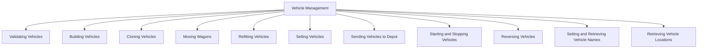

## Overview

Vehicle Management refers to the various operations and functionalities related to handling vehicles within the game. It includes validating vehicles, building new vehicles, cloning existing ones, and moving wagons between vehicles. The system also allows for refitting vehicles to carry different types of cargo, selling vehicles or individual wagons, and sending vehicles to depots for servicing. Additionally, it provides functionalities to start or stop vehicles, reverse their direction, and set or retrieve their names and locations. Vehicle Management ensures that vehicles are properly maintained and operated, contributing to the overall efficiency and effectiveness of the transport network.

<SwmSnippet path="/src/script/api/script_vehicle.cpp" line="31">

---

## Validating Vehicles

The function <SwmToken path="src/script/api/script_vehicle.cpp" pos="31:10:10" line-data="/* static */ bool ScriptVehicle::IsValidVehicle(VehicleID vehicle_id)">`IsValidVehicle`</SwmToken> checks if a vehicle is valid by ensuring it exists and belongs to the correct owner.

```c++
/* static */ bool ScriptVehicle::IsValidVehicle(VehicleID vehicle_id)
{
	EnforceDeityOrCompanyModeValid(false);
	const Vehicle *v = ::Vehicle::GetIfValid(vehicle_id);
	return v != nullptr && (v->owner == ScriptObject::GetCompany() || ScriptCompanyMode::IsDeity()) && (v->IsPrimaryVehicle() || (v->type == VEH_TRAIN && ::Train::From(v)->IsFreeWagon()));
```

---

</SwmSnippet>

<SwmSnippet path="/src/script/api/script_vehicle.cpp" line="74">

---

## Building Vehicles

The function <SwmToken path="src/script/api/script_vehicle.cpp" pos="74:10:10" line-data="/* static */ VehicleID ScriptVehicle::_BuildVehicleInternal(TileIndex depot, EngineID engine_id, CargoID cargo)">`_BuildVehicleInternal`</SwmToken> handles the internal logic for building a vehicle, including precondition checks and executing the build command.

```c++
/* static */ VehicleID ScriptVehicle::_BuildVehicleInternal(TileIndex depot, EngineID engine_id, CargoID cargo)
{
	EnforceCompanyModeValid(VEHICLE_INVALID);
	EnforcePrecondition(VEHICLE_INVALID, ScriptEngine::IsBuildable(engine_id));
	EnforcePrecondition(VEHICLE_INVALID, !::IsValidCargoID(cargo) || ScriptCargo::IsValidCargo(cargo));

	::VehicleType type = ::Engine::Get(engine_id)->type;

	EnforcePreconditionCustomError(VEHICLE_INVALID, !ScriptGameSettings::IsDisabledVehicleType((ScriptVehicle::VehicleType)type), ScriptVehicle::ERR_VEHICLE_BUILD_DISABLED);

	if (!ScriptObject::Command<CMD_BUILD_VEHICLE>::Do(&ScriptInstance::DoCommandReturnVehicleID, depot, engine_id, true, cargo, INVALID_CLIENT_ID)) return VEHICLE_INVALID;

	/* In case of test-mode, we return VehicleID 0 */
	return 0;
```

---

</SwmSnippet>

<SwmSnippet path="/src/script/api/script_vehicle.cpp" line="110">

---

## Cloning Vehicles

The function <SwmToken path="src/script/api/script_vehicle.cpp" pos="110:10:10" line-data="/* static */ VehicleID ScriptVehicle::CloneVehicle(TileIndex depot, VehicleID vehicle_id, bool share_orders)">`CloneVehicle`</SwmToken> clones an existing vehicle, optionally sharing its orders.

```c++
/* static */ VehicleID ScriptVehicle::CloneVehicle(TileIndex depot, VehicleID vehicle_id, bool share_orders)
{
	EnforceCompanyModeValid(false);
	EnforcePrecondition(false, IsPrimaryVehicle(vehicle_id));

	if (!ScriptObject::Command<CMD_CLONE_VEHICLE>::Do(&ScriptInstance::DoCommandReturnVehicleID, depot, vehicle_id, share_orders)) return VEHICLE_INVALID;

	/* In case of test-mode, we return VehicleID 0 */
	return 0;
```

---

</SwmSnippet>

<SwmSnippet path="/src/script/api/script_vehicle.cpp" line="121">

---

## Moving Wagons

The functions <SwmToken path="src/script/api/script_vehicle.cpp" pos="140:10:10" line-data="/* static */ bool ScriptVehicle::MoveWagon(VehicleID source_vehicle_id, SQInteger source_wagon, SQInteger dest_vehicle_id, SQInteger dest_wagon)">`MoveWagon`</SwmToken> and <SwmToken path="src/script/api/script_vehicle.cpp" pos="145:10:10" line-data="/* static */ bool ScriptVehicle::MoveWagonChain(VehicleID source_vehicle_id, SQInteger source_wagon, SQInteger dest_vehicle_id, SQInteger dest_wagon)">`MoveWagonChain`</SwmToken> handle moving individual wagons or chains of wagons between vehicles.

```c++
/* static */ bool ScriptVehicle::_MoveWagonInternal(VehicleID source_vehicle_id, SQInteger source_wagon, bool move_attached_wagons, SQInteger dest_vehicle_id, SQInteger dest_wagon)
{
	EnforceCompanyModeValid(false);
	EnforcePrecondition(false, IsValidVehicle(source_vehicle_id) && source_wagon < GetNumWagons(source_vehicle_id));
	EnforcePrecondition(false, dest_vehicle_id == -1 || (IsValidVehicle(dest_vehicle_id) && dest_wagon < GetNumWagons(dest_vehicle_id)));
	EnforcePrecondition(false, ::Vehicle::Get(source_vehicle_id)->type == VEH_TRAIN);
	EnforcePrecondition(false, dest_vehicle_id == -1 || ::Vehicle::Get(dest_vehicle_id)->type == VEH_TRAIN);

	const Train *v = ::Train::Get(source_vehicle_id);
	while (source_wagon-- > 0) v = v->GetNextUnit();
	const Train *w = nullptr;
	if (dest_vehicle_id != -1) {
		w = ::Train::Get(dest_vehicle_id);
		while (dest_wagon-- > 0) w = w->GetNextUnit();
	}

	return ScriptObject::Command<CMD_MOVE_RAIL_VEHICLE>::Do(v->index, w == nullptr ? ::INVALID_VEHICLE : w->index, move_attached_wagons);
```

---

</SwmSnippet>

<SwmSnippet path="/src/script/api/script_vehicle.cpp" line="150">

---

## Refitting Vehicles

The function <SwmToken path="src/script/api/script_vehicle.cpp" pos="159:10:10" line-data="/* static */ bool ScriptVehicle::RefitVehicle(VehicleID vehicle_id, CargoID cargo)">`RefitVehicle`</SwmToken> refits a vehicle to carry a different type of cargo.

```c++
/* static */ SQInteger ScriptVehicle::GetRefitCapacity(VehicleID vehicle_id, CargoID cargo)
{
	if (!IsValidVehicle(vehicle_id)) return -1;
	if (!ScriptCargo::IsValidCargo(cargo)) return -1;

	auto [res, refit_capacity, refit_mail, cargo_capacities] = ::Command<CMD_REFIT_VEHICLE>::Do(DC_QUERY_COST, vehicle_id, cargo, 0, false, false, 0);
	return res.Succeeded() ? refit_capacity : -1;
}
```

---

</SwmSnippet>

<SwmSnippet path="/src/script/api/script_vehicle.cpp" line="199">

---

## Sending Vehicles to Depot

The function <SwmToken path="src/script/api/script_vehicle.cpp" pos="199:10:10" line-data="/* static */ bool ScriptVehicle::SendVehicleToDepot(VehicleID vehicle_id)">`SendVehicleToDepot`</SwmToken> sends a vehicle to a depot for servicing.

```c++
/* static */ bool ScriptVehicle::SendVehicleToDepot(VehicleID vehicle_id)
{
	EnforceCompanyModeValid(false);
	EnforcePrecondition(false, IsPrimaryVehicle(vehicle_id));

	return ScriptObject::Command<CMD_SEND_VEHICLE_TO_DEPOT>::Do(vehicle_id, DepotCommand::None, {});
```

---

</SwmSnippet>

<SwmSnippet path="/src/script/api/script_vehicle.cpp" line="227">

---

## Starting and Stopping Vehicles

The function <SwmToken path="src/script/api/script_vehicle.cpp" pos="227:10:10" line-data="/* static */ bool ScriptVehicle::StartStopVehicle(VehicleID vehicle_id)">`StartStopVehicle`</SwmToken> starts or stops a vehicle.

```c++
/* static */ bool ScriptVehicle::StartStopVehicle(VehicleID vehicle_id)
{
	EnforceCompanyModeValid(false);
	EnforcePrecondition(false, IsPrimaryVehicle(vehicle_id));

	return ScriptObject::Command<CMD_START_STOP_VEHICLE>::Do(vehicle_id, false);
```

---

</SwmSnippet>

<SwmSnippet path="/src/script/api/script_vehicle.cpp" line="235">

---

## Reversing Vehicles

The function <SwmToken path="src/script/api/script_vehicle.cpp" pos="235:10:10" line-data="/* static */ bool ScriptVehicle::ReverseVehicle(VehicleID vehicle_id)">`ReverseVehicle`</SwmToken> reverses the direction of a vehicle.

```c++
/* static */ bool ScriptVehicle::ReverseVehicle(VehicleID vehicle_id)
{
	EnforceCompanyModeValid(false);
	EnforcePrecondition(false, IsPrimaryVehicle(vehicle_id));
	EnforcePrecondition(false, ::Vehicle::Get(vehicle_id)->type == VEH_ROAD || ::Vehicle::Get(vehicle_id)->type == VEH_TRAIN);

	switch (::Vehicle::Get(vehicle_id)->type) {
		case VEH_ROAD: return ScriptObject::Command<CMD_TURN_ROADVEH>::Do(vehicle_id);
		case VEH_TRAIN: return ScriptObject::Command<CMD_REVERSE_TRAIN_DIRECTION>::Do(vehicle_id, false);
		default: NOT_REACHED();
	}
```

---

</SwmSnippet>

<SwmSnippet path="/src/script/api/script_vehicle.cpp" line="248">

---

## Setting and Retrieving Vehicle Names

The function <SwmToken path="src/script/api/script_vehicle.cpp" pos="248:10:10" line-data="/* static */ bool ScriptVehicle::SetName(VehicleID vehicle_id, Text *name)">`SetName`</SwmToken> sets the name of a vehicle, while <SwmToken path="src/script/api/script_vehicle.cpp" pos="302:17:17" line-data="/* static */ std::optional&lt;std::string&gt; ScriptVehicle::GetName(VehicleID vehicle_id)">`GetName`</SwmToken> retrieves it.

```c++
/* static */ bool ScriptVehicle::SetName(VehicleID vehicle_id, Text *name)
{
	CCountedPtr<Text> counter(name);

	EnforceCompanyModeValid(false);
	EnforcePrecondition(false, IsPrimaryVehicle(vehicle_id));
	EnforcePrecondition(false, name != nullptr);
	const std::string &text = name->GetDecodedText();
	EnforcePreconditionEncodedText(false, text);
	EnforcePreconditionCustomError(false, ::Utf8StringLength(text) < MAX_LENGTH_VEHICLE_NAME_CHARS, ScriptError::ERR_PRECONDITION_STRING_TOO_LONG);

	return ScriptObject::Command<CMD_RENAME_VEHICLE>::Do(vehicle_id, text);
```

---

</SwmSnippet>

<SwmSnippet path="/src/script/api/script_vehicle.cpp" line="262">

---

## Retrieving Vehicle Locations

The function <SwmToken path="src/script/api/script_vehicle.cpp" pos="262:10:10" line-data="/* static */ TileIndex ScriptVehicle::GetLocation(VehicleID vehicle_id)">`GetLocation`</SwmToken> retrieves the current location of a vehicle.

```c++
/* static */ TileIndex ScriptVehicle::GetLocation(VehicleID vehicle_id)
{
	if (!IsValidVehicle(vehicle_id)) return INVALID_TILE;

	const Vehicle *v = ::Vehicle::Get(vehicle_id);
	if (v->type == VEH_AIRCRAFT) {
		uint x = Clamp(v->x_pos / TILE_SIZE, 0, ScriptMap::GetMapSizeX() - 2);
		uint y = Clamp(v->y_pos / TILE_SIZE, 0, ScriptMap::GetMapSizeY() - 2);
		return ::TileXY(x, y);
	}

	return v->tile;
```

---

</SwmSnippet>

&nbsp;

*This is an auto-generated document by Swimm AI 🌊 and has not yet been verified by a human*

<SwmMeta version="3.0.0" repo-id="Z2l0aHViJTNBJTNBT3BlblRURC1jb3BpbG90LWRlbW8lM0ElM0Fzd2ltbWlv" repo-name="OpenTTD-copilot-demo"><sup>Powered by [Swimm](/)</sup></SwmMeta>
