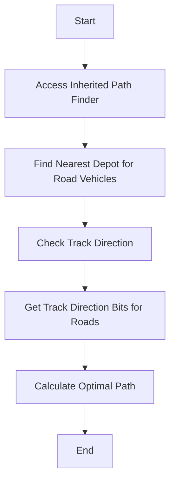

# Overview

Yapf is a pathfinding algorithm used to determine the best path for various types of vehicles, such as ships, road vehicles, and trains. It optimizes the pathfinding process based on distance and penalties, ensuring efficient navigation.

<SwmSnippet path="/src/pathfinder/yapf/yapf_destrail.hpp" line="42">

---

# Accessing Inherited Path Finder

The function <SwmToken path="src/pathfinder/yapf/yapf_destrail.hpp" pos="43:4:4" line-data="	Tpf &amp;Yapf()">`Yapf`</SwmToken> is used to access the inherited pathfinder class, allowing the algorithm to utilize the pathfinding logic defined in the base class.

```c++
	/** to access inherited path finder */
	Tpf &Yapf()
	{
		return *static_cast<Tpf *>(this);
	}
```

---

</SwmSnippet>

<SwmSnippet path="/src/pathfinder/yapf/yapf_road.cpp" line="549">

---

# Finding Nearest Depot for Road Vehicles

The function <SwmToken path="src/pathfinder/yapf/yapf_road.cpp" pos="549:2:2" line-data="FindDepotData YapfRoadVehicleFindNearestDepot(const RoadVehicle *v, int max_distance)">`YapfRoadVehicleFindNearestDepot`</SwmToken> uses Yapf to find the nearest depot for road vehicles, optimizing the path based on distance and penalties.

```c++
FindDepotData YapfRoadVehicleFindNearestDepot(const RoadVehicle *v, int max_distance)
{
	TileIndex tile = v->tile;
	Trackdir trackdir = v->GetVehicleTrackdir();

	if (!HasTrackdir(GetTrackdirBitsForRoad(tile, GetRoadTramType(v->roadtype)), trackdir)) {
		return FindDepotData();
	}

	/* default is YAPF type 2 */
	typedef FindDepotData (*PfnFindNearestDepot)(const RoadVehicle*, TileIndex, Trackdir, int);
	PfnFindNearestDepot pfnFindNearestDepot = &CYapfRoadAnyDepot2::stFindNearestDepot;

	/* check if non-default YAPF type should be used */
	if (_settings_game.pf.yapf.disable_node_optimization) {
		pfnFindNearestDepot = &CYapfRoadAnyDepot1::stFindNearestDepot; // Trackdir
	}

	return pfnFindNearestDepot(v, tile, trackdir, max_distance);
}
```

---

</SwmSnippet>

<SwmSnippet path="/src/track_func.h" line="335">

---

# Checking Track Direction

The function <SwmToken path="src/track_func.h" pos="340:4:4" line-data="inline bool HasTrackdir(TrackdirBits trackdirs, Trackdir trackdir)">`HasTrackdir`</SwmToken> checks whether a given track direction is valid, which is essential for Yapf to determine the best path for vehicles.

```c
/**
 * Checks whether a TrackdirBits has a given Trackdir.
 * @param trackdirs The trackdir bits.
 * @param trackdir The trackdir to check.
 */
inline bool HasTrackdir(TrackdirBits trackdirs, Trackdir trackdir)
{
	assert(IsValidTrackdir(trackdir));
	return HasBit(trackdirs, trackdir);
}
```

---

</SwmSnippet>

<SwmSnippet path="/src/pathfinder/pathfinder_func.h" line="50">

---

# Getting Track Direction Bits for Roads

The function <SwmToken path="src/pathfinder/pathfinder_func.h" pos="60:4:4" line-data="inline TrackdirBits GetTrackdirBitsForRoad(TileIndex tile, RoadTramType rtt)">`GetTrackdirBitsForRoad`</SwmToken> retrieves the track direction bits for a given road tile, which Yapf uses to calculate the optimal path for road vehicles.

```c
/**
 * Wrapper around GetTileTrackStatus() and TrackStatusToTrackdirBits(), as for
 * single tram bits GetTileTrackStatus() returns 0. The reason for this is
 * that there are no half-tile TrackBits in OpenTTD.
 * This tile, however, is a valid tile for trams, one on which they can
 * reverse safely. To "fix" this, pretend that if we are on a half-tile, we
 * are in fact on a straight tram track tile. CFollowTrackT will make sure
 * the pathfinders cannot exit on the wrong side and allows reversing on such
 * tiles.
 */
inline TrackdirBits GetTrackdirBitsForRoad(TileIndex tile, RoadTramType rtt)
{
	TrackdirBits bits = TrackStatusToTrackdirBits(GetTileTrackStatus(tile, TRANSPORT_ROAD, rtt));

	if (rtt == RTT_TRAM && bits == TRACKDIR_BIT_NONE) {
		if (IsNormalRoadTile(tile)) {
			RoadBits rb = GetRoadBits(tile, RTT_TRAM);
			switch (rb) {
				case ROAD_NE:
				case ROAD_SW:
					bits = TRACKDIR_BIT_X_NE | TRACKDIR_BIT_X_SW;
```

---

</SwmSnippet>

# Main Functions

There are several main functions in Yapf. Some of them are Yapf, <SwmToken path="src/pathfinder/yapf/yapf_road.cpp" pos="534:2:2" line-data="Trackdir YapfRoadVehicleChooseTrack(const RoadVehicle *v, TileIndex tile, DiagDirection enterdir, TrackdirBits trackdirs, bool &amp;path_found, RoadVehPathCache &amp;path_cache)">`YapfRoadVehicleChooseTrack`</SwmToken>, <SwmToken path="src/pathfinder/yapf/yapf_road.cpp" pos="549:2:2" line-data="FindDepotData YapfRoadVehicleFindNearestDepot(const RoadVehicle *v, int max_distance)">`YapfRoadVehicleFindNearestDepot`</SwmToken>, and <SwmToken path="src/pathfinder/yapf/yapf_rail.cpp" pos="556:2:2" line-data="Track YapfTrainChooseTrack(const Train *v, TileIndex tile, DiagDirection enterdir, TrackBits tracks, bool &amp;path_found, bool reserve_track, PBSTileInfo *target, TileIndex *dest)">`YapfTrainChooseTrack`</SwmToken>. We will dive a little into <SwmToken path="src/pathfinder/yapf/yapf_road.cpp" pos="534:2:2" line-data="Trackdir YapfRoadVehicleChooseTrack(const RoadVehicle *v, TileIndex tile, DiagDirection enterdir, TrackdirBits trackdirs, bool &amp;path_found, RoadVehPathCache &amp;path_cache)">`YapfRoadVehicleChooseTrack`</SwmToken> and <SwmToken path="src/pathfinder/yapf/yapf_rail.cpp" pos="556:2:2" line-data="Track YapfTrainChooseTrack(const Train *v, TileIndex tile, DiagDirection enterdir, TrackBits tracks, bool &amp;path_found, bool reserve_track, PBSTileInfo *target, TileIndex *dest)">`YapfTrainChooseTrack`</SwmToken>.

<SwmSnippet path="/src/pathfinder/yapf/yapf_road.cpp" line="335">

---

# Yapf

The <SwmToken path="src/pathfinder/yapf/yapf_road.cpp" pos="336:6:6" line-data="	inline Tpf &amp;Yapf()">`Yapf`</SwmToken> function is used to access the inherited pathfinder class. It casts the current object to the <SwmToken path="src/pathfinder/yapf/yapf_road.cpp" pos="336:3:3" line-data="	inline Tpf &amp;Yapf()">`Tpf`</SwmToken> type and returns a reference to it.

```c++
	/** to access inherited path finder */
	inline Tpf &Yapf()
	{
		return *static_cast<Tpf *>(this);
	}
```

---

</SwmSnippet>

<SwmSnippet path="/src/pathfinder/yapf/yapf_road.cpp" line="534">

---

# <SwmToken path="src/pathfinder/yapf/yapf_road.cpp" pos="534:2:2" line-data="Trackdir YapfRoadVehicleChooseTrack(const RoadVehicle *v, TileIndex tile, DiagDirection enterdir, TrackdirBits trackdirs, bool &amp;path_found, RoadVehPathCache &amp;path_cache)">`YapfRoadVehicleChooseTrack`</SwmToken>

The <SwmToken path="src/pathfinder/yapf/yapf_road.cpp" pos="534:2:2" line-data="Trackdir YapfRoadVehicleChooseTrack(const RoadVehicle *v, TileIndex tile, DiagDirection enterdir, TrackdirBits trackdirs, bool &amp;path_found, RoadVehPathCache &amp;path_cache)">`YapfRoadVehicleChooseTrack`</SwmToken> function determines the best track direction for a road vehicle. It uses different pathfinding strategies based on game settings and returns the optimal track direction.

```c++
Trackdir YapfRoadVehicleChooseTrack(const RoadVehicle *v, TileIndex tile, DiagDirection enterdir, TrackdirBits trackdirs, bool &path_found, RoadVehPathCache &path_cache)
{
	/* default is YAPF type 2 */
	typedef Trackdir (*PfnChooseRoadTrack)(const RoadVehicle*, TileIndex, DiagDirection, bool &path_found, RoadVehPathCache &path_cache);
	PfnChooseRoadTrack pfnChooseRoadTrack = &CYapfRoad2::stChooseRoadTrack; // default: ExitDir, allow 90-deg

	/* check if non-default YAPF type should be used */
	if (_settings_game.pf.yapf.disable_node_optimization) {
		pfnChooseRoadTrack = &CYapfRoad1::stChooseRoadTrack; // Trackdir
	}

	Trackdir td_ret = pfnChooseRoadTrack(v, tile, enterdir, path_found, path_cache);
	return (td_ret != INVALID_TRACKDIR) ? td_ret : (Trackdir)FindFirstBit(trackdirs);
}
```

---

</SwmSnippet>

<SwmSnippet path="/src/pathfinder/yapf/yapf_rail.cpp" line="556">

---

# <SwmToken path="src/pathfinder/yapf/yapf_rail.cpp" pos="556:2:2" line-data="Track YapfTrainChooseTrack(const Train *v, TileIndex tile, DiagDirection enterdir, TrackBits tracks, bool &amp;path_found, bool reserve_track, PBSTileInfo *target, TileIndex *dest)">`YapfTrainChooseTrack`</SwmToken>

The <SwmToken path="src/pathfinder/yapf/yapf_rail.cpp" pos="556:2:2" line-data="Track YapfTrainChooseTrack(const Train *v, TileIndex tile, DiagDirection enterdir, TrackBits tracks, bool &amp;path_found, bool reserve_track, PBSTileInfo *target, TileIndex *dest)">`YapfTrainChooseTrack`</SwmToken> function calculates the best track direction for a train. It uses different pathfinding strategies based on game settings and returns the optimal track direction or the first available track.

```c++
Track YapfTrainChooseTrack(const Train *v, TileIndex tile, DiagDirection enterdir, TrackBits tracks, bool &path_found, bool reserve_track, PBSTileInfo *target, TileIndex *dest)
{
	/* default is YAPF type 2 */
	typedef Trackdir (*PfnChooseRailTrack)(const Train*, TileIndex, DiagDirection, TrackBits, bool&, bool, PBSTileInfo*, TileIndex*);
	PfnChooseRailTrack pfnChooseRailTrack = &CYapfRail1::stChooseRailTrack;

	/* check if non-default YAPF type needed */
	if (_settings_game.pf.forbid_90_deg) {
		pfnChooseRailTrack = &CYapfRail2::stChooseRailTrack; // Trackdir, forbid 90-deg
	}

	Trackdir td_ret = pfnChooseRailTrack(v, tile, enterdir, tracks, path_found, reserve_track, target, dest);
	return (td_ret != INVALID_TRACKDIR) ? TrackdirToTrack(td_ret) : FindFirstTrack(tracks);
}
```

---

</SwmSnippet>

# Ship Pathfinding Endpoints

Ship pathfinding endpoints are crucial for determining the best path for ships. The following functions are used for ship pathfinding.

<SwmSnippet path="/src/pathfinder/yapf/yapf_ship.cpp" line="427">

---

# <SwmToken path="src/pathfinder/yapf/yapf_ship.cpp" pos="427:2:2" line-data="Track YapfShipChooseTrack(const Ship *v, TileIndex tile, bool &amp;path_found, ShipPathCache &amp;path_cache)">`YapfShipChooseTrack`</SwmToken>

The <SwmToken path="src/pathfinder/yapf/yapf_ship.cpp" pos="427:2:2" line-data="Track YapfShipChooseTrack(const Ship *v, TileIndex tile, bool &amp;path_found, ShipPathCache &amp;path_cache)">`YapfShipChooseTrack`</SwmToken> function is used to determine the best track direction for a ship to take from its current tile. It considers the ship's current track direction and possible forward directions to find the optimal path.

```c++
Track YapfShipChooseTrack(const Ship *v, TileIndex tile, bool &path_found, ShipPathCache &path_cache)
{
	Trackdir best_origin_dir = INVALID_TRACKDIR;
	const TrackdirBits origin_dirs = TrackdirToTrackdirBits(v->GetVehicleTrackdir());
	const Trackdir td_ret = CYapfShip::ChooseShipTrack(v, tile, origin_dirs, TRACKDIR_BIT_NONE, path_found, path_cache, best_origin_dir);
	return (td_ret != INVALID_TRACKDIR) ? TrackdirToTrack(td_ret) : INVALID_TRACK;
}
```

---

</SwmSnippet>

<SwmSnippet path="/src/pathfinder/yapf/yapf_ship.cpp" line="435">

---

# <SwmToken path="src/pathfinder/yapf/yapf_ship.cpp" pos="435:2:2" line-data="bool YapfShipCheckReverse(const Ship *v, Trackdir *trackdir)">`YapfShipCheckReverse`</SwmToken>

The <SwmToken path="src/pathfinder/yapf/yapf_ship.cpp" pos="435:2:2" line-data="bool YapfShipCheckReverse(const Ship *v, Trackdir *trackdir)">`YapfShipCheckReverse`</SwmToken> function checks whether a ship should reverse to reach its destination. This is particularly useful when the ship is leaving a depot and needs to determine the best direction to take.

```c++
bool YapfShipCheckReverse(const Ship *v, Trackdir *trackdir)
{
	return CYapfShip::CheckShipReverse(v, trackdir);
}
```

---

</SwmSnippet>

&nbsp;

*This is an auto-generated document by Swimm AI 🌊 and has not yet been verified by a human*

<SwmMeta version="3.0.0" repo-id="Z2l0aHViJTNBJTNBT3BlblRURC1jb3BpbG90LWRlbW8lM0ElM0Fzd2ltbWlv" repo-name="OpenTTD-copilot-demo"><sup>Powered by [Swimm](/)</sup></SwmMeta>
