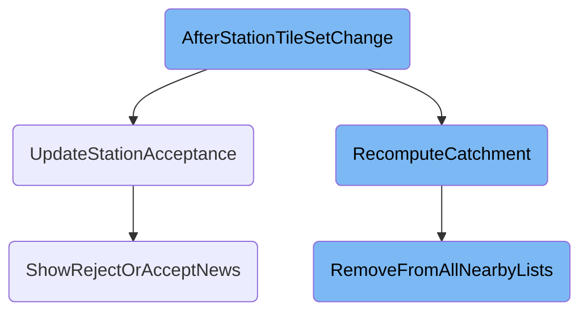
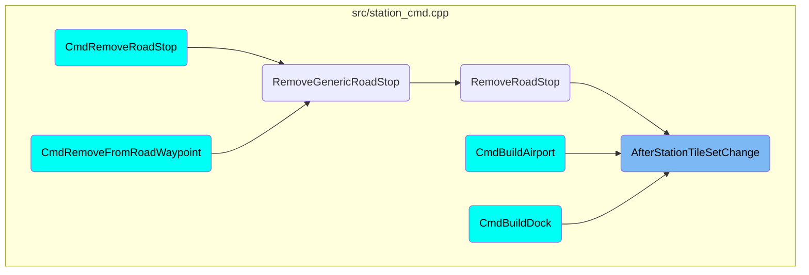

This document explains the process that occurs after tiles are added or removed from a station in the game. The process involves updating various <SwmToken path="src/station_cmd.cpp" pos="749:20:22" line-data=" * After adding/removing tiles to station, update some station-related stuff.">`station-related`</SwmToken> attributes, recalculating the catchment area, and updating the station's acceptance of cargo.

When tiles are added or removed from a station, several updates need to be made to ensure the station functions correctly. First, the station's virtual coordinates are updated. If tiles are added, the catchment area is recalculated, and the station's acceptance of cargo is updated. If tiles are removed, the system checks if the station should be deleted if it becomes empty. Additionally, the catchment tiles are marked as dirty, and certain windows are invalidated based on the type of station. This ensures that the station's catchment area and acceptance status are accurate and up-to-date.

# Flow drill down



<SwmSnippet path="/src/station_cmd.cpp" line="748">

---

## Handling Station Tile Changes

The <SwmToken path="src/station_cmd.cpp" pos="753:4:4" line-data="void Station::AfterStationTileSetChange(bool adding, StationType type)">`AfterStationTileSetChange`</SwmToken> function is responsible for updating various <SwmToken path="src/station_cmd.cpp" pos="749:20:22" line-data=" * After adding/removing tiles to station, update some station-related stuff.">`station-related`</SwmToken> attributes after tiles are added or removed from a station. It updates the virtual coordinates, marks catchment tiles as dirty, and invalidates certain windows based on the type of station. If tiles are added, it recomputes the catchment area and updates the station's acceptance of cargo. If tiles are removed, it checks if the station should be deleted if it becomes empty.

```c++
/**
 * After adding/removing tiles to station, update some station-related stuff.
 * @param adding True if adding tiles, false if removing them.
 * @param type StationType being modified.
 */
void Station::AfterStationTileSetChange(bool adding, StationType type)
{
	this->UpdateVirtCoord();
	DirtyCompanyInfrastructureWindows(this->owner);

	if (adding) {
		this->RecomputeCatchment();
		MarkCatchmentTilesDirty();
		InvalidateWindowData(WC_STATION_LIST, this->owner, 0);
	} else {
		MarkCatchmentTilesDirty();
	}

	switch (type) {
		case STATION_RAIL:
			SetWindowWidgetDirty(WC_STATION_VIEW, this->index, WID_SV_TRAINS);
```

---

</SwmSnippet>

<SwmSnippet path="/src/station_cmd.cpp" line="620">

---

### Updating Station Acceptance

The <SwmToken path="src/station_cmd.cpp" pos="625:2:2" line-data="void UpdateStationAcceptance(Station *st, bool show_msg)">`UpdateStationAcceptance`</SwmToken> function updates the types of cargo a station accepts. It compares the old and new acceptance masks and adjusts the station's acceptance status accordingly. If there are changes in acceptance, it shows a news message to inform the player and updates the station view.

```c++
/**
 * Update the acceptance for a station.
 * @param st Station to update
 * @param show_msg controls whether to display a message that acceptance was changed.
 */
void UpdateStationAcceptance(Station *st, bool show_msg)
{
	/* old accepted goods types */
	CargoTypes old_acc = GetAcceptanceMask(st);

	/* And retrieve the acceptance. */
	CargoArray acceptance{};
	if (!st->rect.IsEmpty()) {
		acceptance = GetAcceptanceAroundStation(st, &st->always_accepted);
	}

	/* Adjust in case our station only accepts fewer kinds of goods */
	for (CargoID i = 0; i < NUM_CARGO; i++) {
		uint amt = acceptance[i];

		/* Make sure the station can accept the goods type. */
```

---

</SwmSnippet>

<SwmSnippet path="/src/station.cpp" line="464">

---

## Recomputing Catchment Area

The <SwmToken path="src/station.cpp" pos="469:4:4" line-data="void Station::RecomputeCatchment(bool no_clear_nearby_lists)">`RecomputeCatchment`</SwmToken> function recalculates the tiles covered by the station's catchment area. It also updates the lists of nearby towns and industries that the station can serve. This ensures that the station's catchment area is accurate and up-to-date after any changes to the station's tiles.

```c++
/**
 * Recompute tiles covered in our catchment area.
 * This will additionally recompute nearby towns and industries.
 * @param no_clear_nearby_lists If Station::RemoveFromAllNearbyLists does not need to be called.
 */
void Station::RecomputeCatchment(bool no_clear_nearby_lists)
{
	this->industries_near.clear();
	if (!no_clear_nearby_lists) this->RemoveFromAllNearbyLists();

	if (this->rect.IsEmpty()) {
		this->catchment_tiles.Reset();
		return;
	}

	if (!_settings_game.station.serve_neutral_industries && this->industry != nullptr) {
		/* Station is associated with an industry, so we only need to deliver to that industry. */
		this->catchment_tiles.Initialize(this->industry->location);
		for (TileIndex tile : this->industry->location) {
			if (IsTileType(tile, MP_INDUSTRY) && GetIndustryIndex(tile) == this->industry->index) {
				this->catchment_tiles.SetTile(tile);
```

---

</SwmSnippet>

<SwmSnippet path="/src/station.cpp" line="427">

---

### Removing from Nearby Lists

The <SwmToken path="src/station.cpp" pos="430:4:4" line-data="void Station::RemoveFromAllNearbyLists()">`RemoveFromAllNearbyLists`</SwmToken> function removes the station from the lists of nearby towns and industries. This is necessary when the station's catchment area is recalculated to ensure that the lists are accurate and do not contain outdated information.

```c++
/**
 * Remove this station from the nearby stations lists of nearby towns and industries.
 */
void Station::RemoveFromAllNearbyLists()
{
	std::set<TownID> towns;
	std::set<IndustryID> industries;

	for (const auto &tile : this->catchment_tiles) {
		TileType type = GetTileType(tile);
		if (type == MP_HOUSE) {
			towns.insert(GetTownIndex(tile));
		} else if (type == MP_INDUSTRY) {
			industries.insert(GetIndustryIndex(tile));
		}
	}

	for (const TownID &townid : towns) { Town::Get(townid)->stations_near.erase(this); }
	for (const IndustryID &industryid : industries) { Industry::Get(industryid)->stations_near.erase(this); }
}
```

---

</SwmSnippet>

<SwmSnippet path="/src/station_cmd.cpp" line="526">

---

### Showing Acceptance News

The <SwmToken path="src/station_cmd.cpp" pos="532:4:4" line-data="static void ShowRejectOrAcceptNews(const Station *st, CargoTypes cargoes, bool reject)">`ShowRejectOrAcceptNews`</SwmToken> function adds a news item to inform the player when a station changes the types of cargo it accepts. This helps keep the player informed about important changes to their stations.

```c++
/**
 * Add news item for when a station changes which cargoes it accepts.
 * @param st Station of cargo change.
 * @param cargoes Bit mask of cargo types to list.
 * @param reject True iff the station rejects the cargo types.
 */
static void ShowRejectOrAcceptNews(const Station *st, CargoTypes cargoes, bool reject)
{
	SetDParam(0, st->index);
	SetDParam(1, cargoes);
	StringID msg = reject ? STR_NEWS_STATION_NO_LONGER_ACCEPTS_CARGO_LIST : STR_NEWS_STATION_NOW_ACCEPTS_CARGO_LIST;
	AddNewsItem(msg, NT_ACCEPTANCE, NF_INCOLOUR | NF_SMALL, NR_STATION, st->index);
}
```

---

</SwmSnippet>

# Where is this flow used?

This flow is used multiple times in the codebase as represented in the following diagram:



&nbsp;

*This is an auto-generated document by Swimm AI 🌊 and has not yet been verified by a human*

<SwmMeta version="3.0.0" repo-id="Z2l0aHViJTNBJTNBT3BlblRURC1jb3BpbG90LWRlbW8lM0ElM0Fzd2ltbWlv" repo-name="OpenTTD-copilot-demo"><sup>Powered by [Swimm](/)</sup></SwmMeta>
