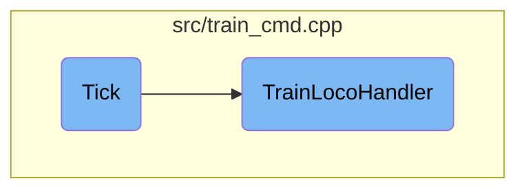

In this document, we will explain the process of updating train statuses using the <SwmToken path="src/train_cmd.cpp" pos="4114:4:4" line-data="bool Train::Tick()">`Tick`</SwmToken> function. This process involves incrementing the tick counter, checking the train's status, and handling locomotive-specific logic.

The flow starts with the <SwmToken path="src/train_cmd.cpp" pos="4114:4:4" line-data="bool Train::Tick()">`Tick`</SwmToken> function, which increments the tick counter for a train. If the train is the front engine, it updates the running ticks and current order time. Then, it calls the <SwmToken path="src/train_cmd.cpp" pos="3945:4:4" line-data="static bool TrainLocoHandler(Train *v, bool mode)">`TrainLocoHandler`</SwmToken> to manage locomotive-specific logic. If the train is a free wagon and has crashed, it will be deleted after a certain animation position.

# Flow drill down



<SwmSnippet path="/src/train_cmd.cpp" line="4114">

---

## Handling Train Status Updates

The <SwmToken path="src/train_cmd.cpp" pos="4114:4:4" line-data="bool Train::Tick()">`Tick`</SwmToken> function is responsible for updating the train's status every tick. It increments the tick counter and checks if the train is the front engine. If it is, it updates the running ticks and current order time. It then calls <SwmToken path="src/train_cmd.cpp" pos="4125:5:5" line-data="		if (!TrainLocoHandler(this, false)) return false;">`TrainLocoHandler`</SwmToken> to handle locomotive-specific logic. If the train is a free wagon and has crashed, it deletes the train after a certain animation position.

```c++
bool Train::Tick()
{
	this->tick_counter++;

	if (this->IsFrontEngine()) {
		PerformanceAccumulator framerate(PFE_GL_TRAINS);

		if (!(this->vehstatus & VS_STOPPED) || this->cur_speed > 0) this->running_ticks++;

		this->current_order_time++;

		if (!TrainLocoHandler(this, false)) return false;

		return TrainLocoHandler(this, true);
	} else if (this->IsFreeWagon() && (this->vehstatus & VS_CRASHED)) {
		/* Delete flooded standalone wagon chain */
		if (++this->crash_anim_pos >= 4400) {
			delete this;
			return false;
		}
	}
```

---

</SwmSnippet>

<SwmSnippet path="/src/train_cmd.cpp" line="3945">

---

## Managing Train Movements

The <SwmToken path="src/train_cmd.cpp" pos="3945:4:4" line-data="static bool TrainLocoHandler(Train *v, bool mode)">`TrainLocoHandler`</SwmToken> function manages various aspects of train movements and status. It handles scenarios such as train crashes, breakdowns, reversing direction, and processing orders. It also manages path reservations when leaving a station, loading and unloading cargo, and updating the train's speed and position. The function ensures that trains follow their orders and handle any obstacles or conditions that may arise during their journey.

```c++
static bool TrainLocoHandler(Train *v, bool mode)
{
	/* train has crashed? */
	if (v->vehstatus & VS_CRASHED) {
		return mode ? true : HandleCrashedTrain(v); // 'this' can be deleted here
	}

	if (v->force_proceed != TFP_NONE) {
		ClrBit(v->flags, VRF_TRAIN_STUCK);
		SetWindowWidgetDirty(WC_VEHICLE_VIEW, v->index, WID_VV_START_STOP);
	}

	/* train is broken down? */
	if (v->HandleBreakdown()) return true;

	if (HasBit(v->flags, VRF_REVERSING) && v->cur_speed == 0) {
		ReverseTrainDirection(v);
	}

	/* exit if train is stopped */
	if ((v->vehstatus & VS_STOPPED) && v->cur_speed == 0) return true;
```

---

</SwmSnippet>

&nbsp;

*This is an auto-generated document by Swimm AI 🌊 and has not yet been verified by a human*

<SwmMeta version="3.0.0" repo-id="Z2l0aHViJTNBJTNBT3BlblRURC1jb3BpbG90LWRlbW8lM0ElM0Fzd2ltbWlv" repo-name="OpenTTD-copilot-demo"><sup>Powered by [Swimm](/)</sup></SwmMeta>
