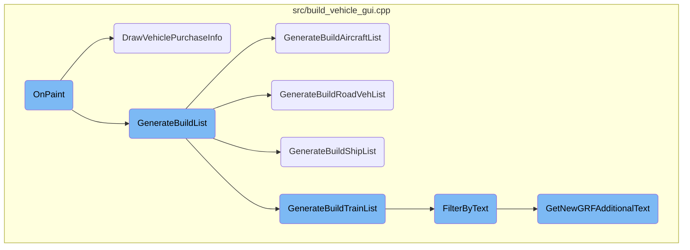
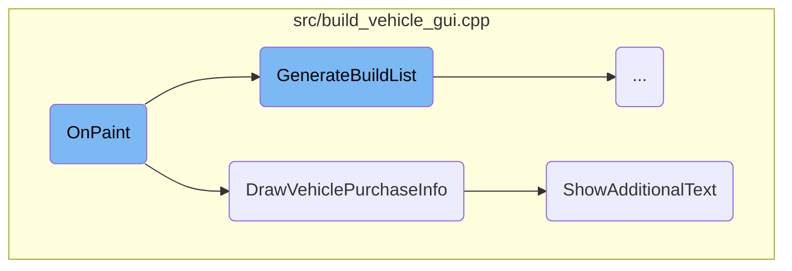
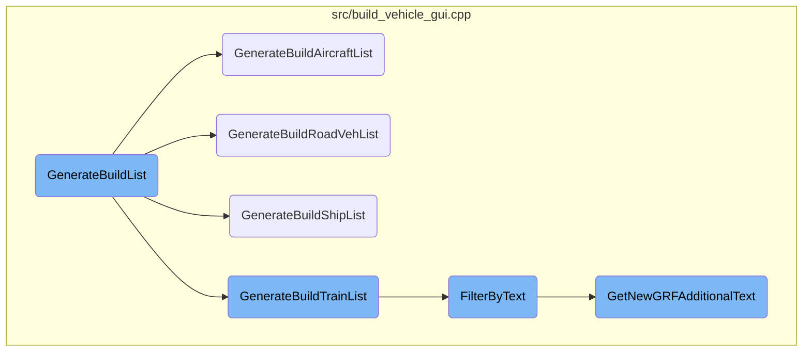

In this document, we will explain the process of updating the vehicle purchase interface. The process involves generating the list of available vehicles, updating the interface elements, and displaying detailed information about the selected vehicle.

The flow starts with generating a list of available vehicles. This list is then used to update the vehicle purchase interface, ensuring that all available options are displayed. If a vehicle is selected, detailed information about it is shown, including its type, cargo capacity, and other relevant details. This helps users make informed decisions about their vehicle purchases.

Here is a high level diagram of the flow, showing only the most important functions:



# Flow drill down

First, we'll zoom into this section of the flow:



<SwmSnippet path="/src/build_vehicle_gui.cpp" line="1831">

---

## <SwmToken path="src/build_vehicle_gui.cpp" pos="1831:3:3" line-data="	void OnPaint() override">`OnPaint`</SwmToken>

The <SwmToken path="src/build_vehicle_gui.cpp" pos="1831:3:3" line-data="	void OnPaint() override">`OnPaint`</SwmToken> function is responsible for generating the build list and updating the vehicle purchase interface. It ensures that the list of available vehicles is up-to-date and adjusts the interface elements based on the selected vehicle and network conditions. If a vehicle is selected, it calls <SwmToken path="src/build_vehicle_gui.cpp" pos="1848:7:7" line-data="				int text_end = DrawVehiclePurchaseInfo(r.left, r.right, r.top, this-&gt;sel_engine, this-&gt;te);">`DrawVehiclePurchaseInfo`</SwmToken> to display detailed information about the vehicle.

```c++
	void OnPaint() override
	{
		this->GenerateBuildList();
		this->vscroll->SetCount(this->eng_list.size());

		this->SetWidgetsDisabledState(this->sel_engine == INVALID_ENGINE, WID_BV_SHOW_HIDE, WID_BV_BUILD);

		/* Disable renaming engines in network games if you are not the server. */
		this->SetWidgetDisabledState(WID_BV_RENAME, this->sel_engine == INVALID_ENGINE || (_networking && !_network_server));

		this->DrawWidgets();

		if (!this->IsShaded()) {
			int needed_height = this->details_height;
			/* Draw details panels. */
			if (this->sel_engine != INVALID_ENGINE) {
				const Rect r = this->GetWidget<NWidgetBase>(WID_BV_PANEL)->GetCurrentRect().Shrink(WidgetDimensions::scaled.framerect);
				int text_end = DrawVehiclePurchaseInfo(r.left, r.right, r.top, this->sel_engine, this->te);
				needed_height = std::max(needed_height, (text_end - r.top) / GetCharacterHeight(FS_NORMAL));
			}
			if (needed_height != this->details_height) { // Details window are not high enough, enlarge them.
```

---

</SwmSnippet>

<SwmSnippet path="/src/build_vehicle_gui.cpp" line="911">

---

## <SwmToken path="src/build_vehicle_gui.cpp" pos="917:2:2" line-data="int DrawVehiclePurchaseInfo(int left, int right, int y, EngineID engine_number, TestedEngineDetails &amp;te)">`DrawVehiclePurchaseInfo`</SwmToken>

The <SwmToken path="src/build_vehicle_gui.cpp" pos="917:2:2" line-data="int DrawVehiclePurchaseInfo(int left, int right, int y, EngineID engine_number, TestedEngineDetails &amp;te)">`DrawVehiclePurchaseInfo`</SwmToken> function draws detailed information about a selected vehicle, such as its type, cargo capacity, design date, life length, and reliability. It also includes additional text from <SwmToken path="src/build_vehicle_gui.cpp" pos="878:11:11" line-data=" * Display additional text from NewGRF in the purchase information window">`NewGRF`</SwmToken> and the name of the <SwmToken path="src/build_vehicle_gui.cpp" pos="878:11:11" line-data=" * Display additional text from NewGRF in the purchase information window">`NewGRF`</SwmToken> from which the vehicle originates. This function ensures that users have all the necessary information to make informed decisions about vehicle purchases.

```c++
/**
 * Draw the purchase info details of a vehicle at a given location.
 * @param left,right,y location where to draw the info
 * @param engine_number the engine of which to draw the info of
 * @return y after drawing all the text
 */
int DrawVehiclePurchaseInfo(int left, int right, int y, EngineID engine_number, TestedEngineDetails &te)
{
	const Engine *e = Engine::Get(engine_number);
	TimerGameCalendar::YearMonthDay ymd = TimerGameCalendar::ConvertDateToYMD(e->intro_date);
	bool refittable = IsArticulatedVehicleRefittable(engine_number);
	bool articulated_cargo = false;

	switch (e->type) {
		default: NOT_REACHED();
		case VEH_TRAIN:
			if (e->u.rail.railveh_type == RAILVEH_WAGON) {
				y = DrawRailWagonPurchaseInfo(left, right, y, engine_number, &e->u.rail, te);
			} else {
				y = DrawRailEnginePurchaseInfo(left, right, y, engine_number, &e->u.rail, te);
			}
```

---

</SwmSnippet>

<SwmSnippet path="/src/build_vehicle_gui.cpp" line="877">

---

### Displaying Additional Text

The <SwmToken path="src/build_vehicle_gui.cpp" pos="885:4:4" line-data="static uint ShowAdditionalText(int left, int right, int y, EngineID engine)">`ShowAdditionalText`</SwmToken> function retrieves and displays additional text from <SwmToken path="src/build_vehicle_gui.cpp" pos="878:11:11" line-data=" * Display additional text from NewGRF in the purchase information window">`NewGRF`</SwmToken> in the vehicle purchase information window. This text provides extra details that may influence the user's decision to purchase a vehicle.

```c++
/**
 * Display additional text from NewGRF in the purchase information window
 * @param left   Left border of text bounding box
 * @param right  Right border of text bounding box
 * @param y      Top border of text bounding box
 * @param engine Engine to query the additional purchase information for
 * @return       Bottom border of text bounding box
 */
static uint ShowAdditionalText(int left, int right, int y, EngineID engine)
{
	auto text = GetNewGRFAdditionalText(engine);
	if (!text) return y;
	return DrawStringMultiLine(left, right, y, INT32_MAX, *text, TC_BLACK);
}
```

---

</SwmSnippet>

Now, lets zoom into this section of the flow:



<SwmSnippet path="/src/build_vehicle_gui.cpp" line="1529">

---

## <SwmToken path="src/build_vehicle_gui.cpp" pos="1529:3:3" line-data="	void GenerateBuildList()">`GenerateBuildList`</SwmToken>

The <SwmToken path="src/build_vehicle_gui.cpp" pos="1529:3:3" line-data="	void GenerateBuildList()">`GenerateBuildList`</SwmToken> function is responsible for generating the list of vehicles available for the user to build. It first checks if the list needs to be rebuilt and updates the filter type. It then clears the existing list and generates new lists based on the vehicle type (train, road vehicle, ship, or aircraft). After generating the specific vehicle lists, it filters the list and ensures that primary engines of variant groups are included. Finally, it sorts the list based on the selected criteria.

```c++
	void GenerateBuildList()
	{
		if (!this->eng_list.NeedRebuild()) return;

		/* Update filter type in case the road/railtype of the depot got converted */
		this->UpdateFilterByTile();

		this->eng_list.clear();

		GUIEngineList list;

		switch (this->vehicle_type) {
			default: NOT_REACHED();
			case VEH_TRAIN:
				this->GenerateBuildTrainList(list);
				GUIEngineListAddChildren(this->eng_list, list);
				this->eng_list.RebuildDone();
				return;
			case VEH_ROAD:
				this->GenerateBuildRoadVehList();
				break;
```

---

</SwmSnippet>

<SwmSnippet path="/src/build_vehicle_gui.cpp" line="1498">

---

## <SwmToken path="src/build_vehicle_gui.cpp" pos="1498:3:3" line-data="	void GenerateBuildAircraftList()">`GenerateBuildAircraftList`</SwmToken>

The <SwmToken path="src/build_vehicle_gui.cpp" pos="1498:3:3" line-data="	void GenerateBuildAircraftList()">`GenerateBuildAircraftList`</SwmToken> function generates a list of aircraft engines available for building. It iterates through all available aircraft engines, filters them based on visibility, buildability, and station compatibility, and adds them to the list if they pass the filters. It also checks if the previously selected engine is still available and updates the selection accordingly.

```c++
	void GenerateBuildAircraftList()
	{
		EngineID sel_id = INVALID_ENGINE;

		this->eng_list.clear();

		const Station *st = this->listview_mode ? nullptr : Station::GetByTile(this->window_number);

		/* Make list of all available planes.
		 * Also check to see if the previously selected plane is still available,
		 * and if not, reset selection to INVALID_ENGINE. This could be the case
		 * when planes become obsolete and are removed */
		for (const Engine *e : Engine::IterateType(VEH_AIRCRAFT)) {
			if (!this->show_hidden_engines && e->IsVariantHidden(_local_company)) continue;
			EngineID eid = e->index;
			if (!IsEngineBuildable(eid, VEH_AIRCRAFT, _local_company)) continue;
			/* First VEH_END window_numbers are fake to allow a window open for all different types at once */
			if (!this->listview_mode && !CanVehicleUseStation(eid, st)) continue;

			/* Filter by name or NewGRF extra text */
			if (!FilterByText(e)) continue;
```

---

</SwmSnippet>

<SwmSnippet path="/src/build_vehicle_gui.cpp" line="1454">

---

## <SwmToken path="src/build_vehicle_gui.cpp" pos="1454:3:3" line-data="	void GenerateBuildRoadVehList()">`GenerateBuildRoadVehList`</SwmToken>

The <SwmToken path="src/build_vehicle_gui.cpp" pos="1454:3:3" line-data="	void GenerateBuildRoadVehList()">`GenerateBuildRoadVehList`</SwmToken> function generates a list of road vehicle engines available for building. It iterates through all available road vehicle engines, filters them based on visibility, buildability, and road type compatibility, and adds them to the list if they pass the filters. It also checks if the previously selected engine is still available and updates the selection accordingly.

```c++
	void GenerateBuildRoadVehList()
	{
		EngineID sel_id = INVALID_ENGINE;

		this->eng_list.clear();

		for (const Engine *e : Engine::IterateType(VEH_ROAD)) {
			if (!this->show_hidden_engines && e->IsVariantHidden(_local_company)) continue;
			EngineID eid = e->index;
			if (!IsEngineBuildable(eid, VEH_ROAD, _local_company)) continue;
			if (this->filter.roadtype != INVALID_ROADTYPE && !HasPowerOnRoad(e->u.road.roadtype, this->filter.roadtype)) continue;

			/* Filter by name or NewGRF extra text */
			if (!FilterByText(e)) continue;

			this->eng_list.emplace_back(eid, e->info.variant_id, e->display_flags, 0);

			if (eid == this->sel_engine) sel_id = eid;
		}
		this->SelectEngine(sel_id);
	}
```

---

</SwmSnippet>

<SwmSnippet path="/src/build_vehicle_gui.cpp" line="1478">

---

## <SwmToken path="src/build_vehicle_gui.cpp" pos="1477:3:3" line-data="	void GenerateBuildShipList()">`GenerateBuildShipList`</SwmToken>

The <SwmToken path="src/build_vehicle_gui.cpp" pos="1477:3:3" line-data="	void GenerateBuildShipList()">`GenerateBuildShipList`</SwmToken> function generates a list of ship engines available for building. It iterates through all available ship engines, filters them based on visibility and buildability, and adds them to the list if they pass the filters. It also checks if the previously selected engine is still available and updates the selection accordingly.

```c++
	{
		EngineID sel_id = INVALID_ENGINE;
		this->eng_list.clear();

		for (const Engine *e : Engine::IterateType(VEH_SHIP)) {
			if (!this->show_hidden_engines && e->IsVariantHidden(_local_company)) continue;
			EngineID eid = e->index;
			if (!IsEngineBuildable(eid, VEH_SHIP, _local_company)) continue;

			/* Filter by name or NewGRF extra text */
			if (!FilterByText(e)) continue;

			this->eng_list.emplace_back(eid, e->info.variant_id, e->display_flags, 0);

			if (eid == this->sel_engine) sel_id = eid;
		}
		this->SelectEngine(sel_id);
	}
```

---

</SwmSnippet>

<SwmSnippet path="/src/build_vehicle_gui.cpp" line="1387">

---

## <SwmToken path="src/build_vehicle_gui.cpp" pos="1387:3:3" line-data="	void GenerateBuildTrainList(GUIEngineList &amp;list)">`GenerateBuildTrainList`</SwmToken>

The <SwmToken path="src/build_vehicle_gui.cpp" pos="1387:3:3" line-data="	void GenerateBuildTrainList(GUIEngineList &amp;list)">`GenerateBuildTrainList`</SwmToken> function generates a list of train engines and wagons available for building. It iterates through all available train engines and wagons, filters them based on visibility, buildability, and rail type compatibility, and adds them to the list if they pass the filters. It also ensures that primary engines of variant groups are included and sorts the list based on the selected criteria.

```c++
	void GenerateBuildTrainList(GUIEngineList &list)
	{
		std::vector<EngineID> variants;
		EngineID sel_id = INVALID_ENGINE;
		size_t num_engines = 0;

		list.clear();

		/* Make list of all available train engines and wagons.
		 * Also check to see if the previously selected engine is still available,
		 * and if not, reset selection to INVALID_ENGINE. This could be the case
		 * when engines become obsolete and are removed */
		for (const Engine *e : Engine::IterateType(VEH_TRAIN)) {
			if (!this->show_hidden_engines && e->IsVariantHidden(_local_company)) continue;
			EngineID eid = e->index;
			const RailVehicleInfo *rvi = &e->u.rail;

			if (this->filter.railtype != INVALID_RAILTYPE && !HasPowerOnRail(rvi->railtype, this->filter.railtype)) continue;
			if (!IsEngineBuildable(eid, VEH_TRAIN, _local_company)) continue;

			/* Filter now! So num_engines and num_wagons is valid */
```

---

</SwmSnippet>

<SwmSnippet path="/src/build_vehicle_gui.cpp" line="1369">

---

## <SwmToken path="src/build_vehicle_gui.cpp" pos="1369:3:3" line-data="	bool FilterByText(const Engine *e)">`FilterByText`</SwmToken>

The <SwmToken path="src/build_vehicle_gui.cpp" pos="1369:3:3" line-data="	bool FilterByText(const Engine *e)">`FilterByText`</SwmToken> function filters engines based on the text entered by the user in the filter text box. It checks if the filter text box is empty and, if not, filters the engine name and any additional text provided by <SwmToken path="src/build_vehicle_gui.cpp" pos="1379:5:5" line-data="		/* Filter NewGRF extra text */">`NewGRF`</SwmToken>. This ensures that only engines matching the user's search criteria are included in the list.

```c++
	bool FilterByText(const Engine *e)
	{
		/* Do not filter if the filter text box is empty */
		if (this->string_filter.IsEmpty()) return true;

		/* Filter engine name */
		this->string_filter.ResetState();
		SetDParam(0, PackEngineNameDParam(e->index, EngineNameContext::PurchaseList));
		this->string_filter.AddLine(GetString(STR_ENGINE_NAME));

		/* Filter NewGRF extra text */
		auto text = GetNewGRFAdditionalText(e->index);
		if (text) this->string_filter.AddLine(*text);

		return this->string_filter.GetState();
	}
```

---

</SwmSnippet>

<SwmSnippet path="/src/build_vehicle_gui.cpp" line="860">

---

## <SwmToken path="src/build_vehicle_gui.cpp" pos="860:11:11" line-data="static std::optional&lt;std::string&gt; GetNewGRFAdditionalText(EngineID engine)">`GetNewGRFAdditionalText`</SwmToken>

The <SwmToken path="src/build_vehicle_gui.cpp" pos="860:11:11" line-data="static std::optional&lt;std::string&gt; GetNewGRFAdditionalText(EngineID engine)">`GetNewGRFAdditionalText`</SwmToken> function retrieves additional text for an engine from <SwmToken path="src/build_vehicle_gui.cpp" pos="878:11:11" line-data=" * Display additional text from NewGRF in the purchase information window">`NewGRF`</SwmToken>, if available. This text can be used for filtering engines based on custom criteria defined by <SwmToken path="src/build_vehicle_gui.cpp" pos="878:11:11" line-data=" * Display additional text from NewGRF in the purchase information window">`NewGRF`</SwmToken>, providing more flexibility in the filtering process.

```c++
static std::optional<std::string> GetNewGRFAdditionalText(EngineID engine)
{
	uint16_t callback = GetVehicleCallback(CBID_VEHICLE_ADDITIONAL_TEXT, 0, 0, engine, nullptr);
	if (callback == CALLBACK_FAILED || callback == 0x400) return std::nullopt;
	const GRFFile *grffile = Engine::Get(engine)->GetGRF();
	assert(grffile != nullptr);
	if (callback > 0x400) {
		ErrorUnknownCallbackResult(grffile->grfid, CBID_VEHICLE_ADDITIONAL_TEXT, callback);
		return std::nullopt;
	}

	StartTextRefStackUsage(grffile, 6);
	std::string result = GetString(GetGRFStringID(grffile->grfid, 0xD000 + callback));
	StopTextRefStackUsage();
	return result;
}
```

---

</SwmSnippet>

&nbsp;

*This is an auto-generated document by Swimm AI 🌊 and has not yet been verified by a human*

<SwmMeta version="3.0.0" repo-id="Z2l0aHViJTNBJTNBT3BlblRURC1jb3BpbG90LWRlbW8lM0ElM0Fzd2ltbWlv" repo-name="OpenTTD-copilot-demo"><sup>Powered by [Swimm](/)</sup></SwmMeta>
