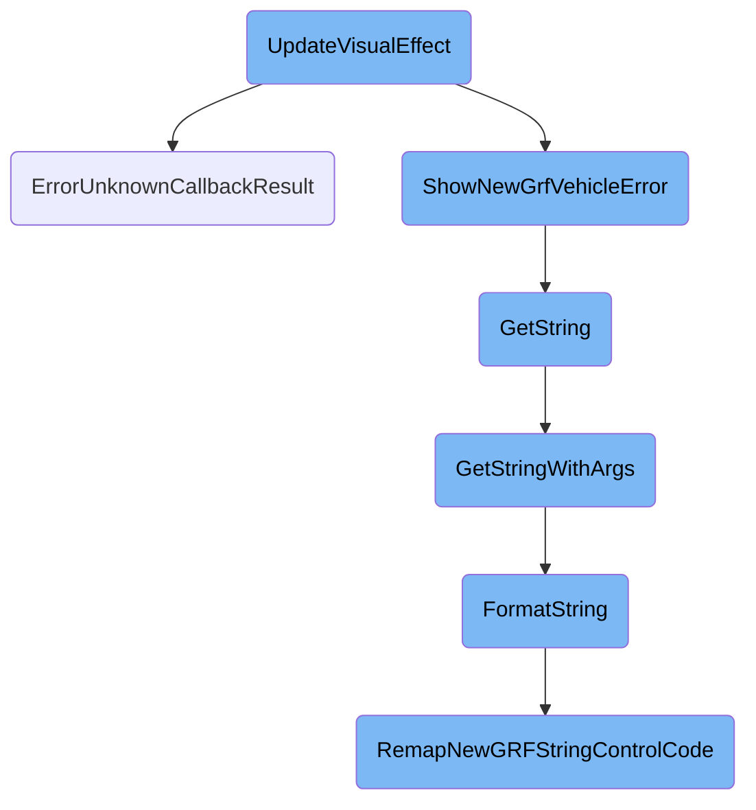
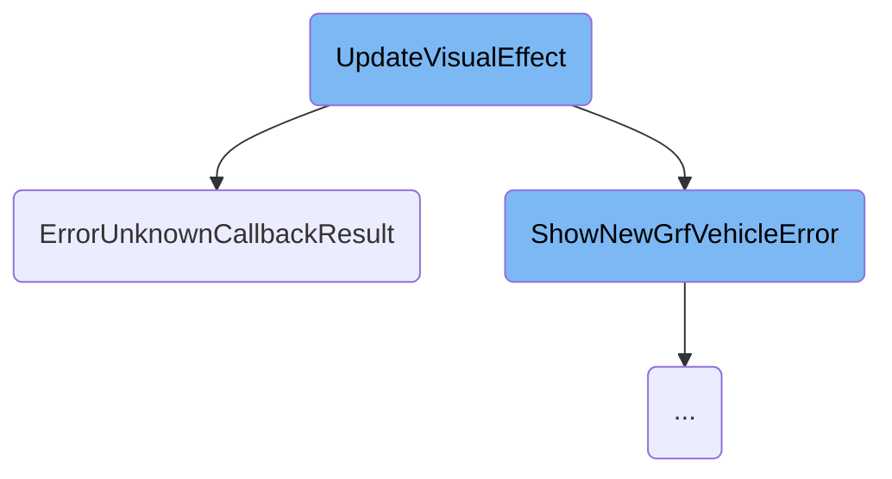
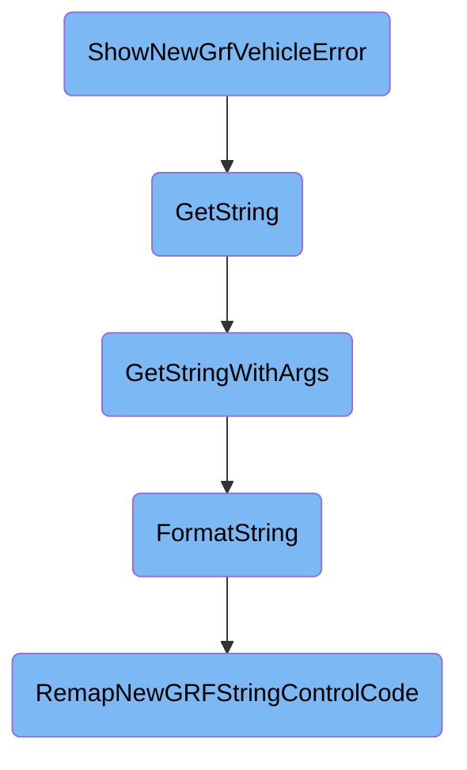
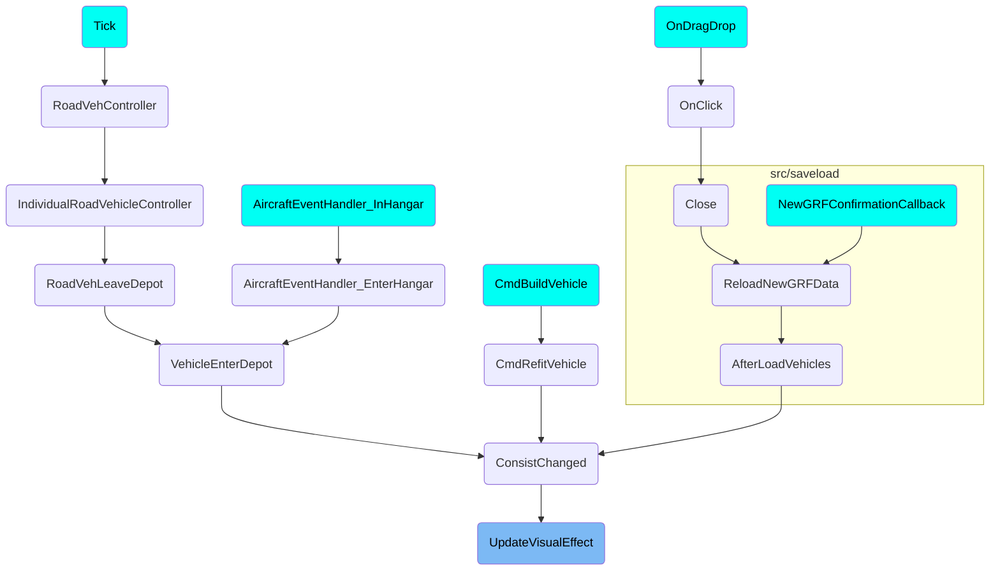

This document explains the process of updating visual effects for vehicles. The process involves evaluating the visual effect properties of a vehicle's engine, handling visual effect callbacks, and reporting errors if necessary.

The flow starts with evaluating the visual effect properties of a vehicle's engine. If the engine has a visual effect callback, the callback result is processed. If the visual effect changes the powered state of the wagon and power change is not allowed, an error is reported. The error reporting involves recording the error, preparing error messages, and displaying them to the user. Additionally, the flow includes resolving string identifiers, parsing strings with arguments, formatting strings, and remapping <SwmToken path="src/vehicle.cpp" pos="310:8:8" line-data=" * Displays a &quot;NewGrf Bug&quot; error message for a engine, and pauses the game if not networking.">`NewGrf`</SwmToken> string control codes to ensure that the visual effects are correctly interpreted and displayed.

Here is a high level diagram of the flow, showing only the most important functions:



# Flow drill down

First, we'll zoom into this section of the flow:



<SwmSnippet path="/src/vehicle.cpp" line="2664">

---

## Handling Visual Effect Updates

The <SwmToken path="src/vehicle.cpp" pos="2664:4:4" line-data="void Vehicle::UpdateVisualEffect(bool allow_power_change)">`UpdateVisualEffect`</SwmToken> function is responsible for updating the visual effects of vehicles based on their type and engine properties. It evaluates the visual effect properties of the vehicle's engine and applies default values if necessary. If the engine has a visual effect callback, it processes the callback result and updates the visual effect accordingly. If the visual effect changes the powered state of the wagon and power change is not allowed, it reports an error using <SwmToken path="src/vehicle.cpp" pos="317:2:2" line-data="void ShowNewGrfVehicleError(EngineID engine, StringID part1, StringID part2, GRFBugs bug_type, bool critical)">`ShowNewGrfVehicleError`</SwmToken>.

```c++
void Vehicle::UpdateVisualEffect(bool allow_power_change)
{
	bool powered_before = HasBit(this->vcache.cached_vis_effect, VE_DISABLE_WAGON_POWER);
	const Engine *e = this->GetEngine();

	/* Evaluate properties */
	uint8_t visual_effect;
	switch (e->type) {
		case VEH_TRAIN: visual_effect = e->u.rail.visual_effect; break;
		case VEH_ROAD:  visual_effect = e->u.road.visual_effect; break;
		case VEH_SHIP:  visual_effect = e->u.ship.visual_effect; break;
		default:        visual_effect = 1 << VE_DISABLE_EFFECT;  break;
	}

	/* Check powered wagon / visual effect callback */
	if (HasBit(e->info.callback_mask, CBM_VEHICLE_VISUAL_EFFECT)) {
		uint16_t callback = GetVehicleCallback(CBID_VEHICLE_VISUAL_EFFECT, 0, 0, this->engine_type, this);

		if (callback != CALLBACK_FAILED) {
			if (callback >= 0x100 && e->GetGRF()->grf_version >= 8) ErrorUnknownCallbackResult(e->GetGRFID(), CBID_VEHICLE_VISUAL_EFFECT, callback);

```

---

</SwmSnippet>

<SwmSnippet path="/src/newgrf_commons.cpp" line="505">

---

## Reporting Invalid Callback Results

The <SwmToken path="src/newgrf_commons.cpp" pos="505:2:2" line-data="void ErrorUnknownCallbackResult(uint32_t grfid, uint16_t cbid, uint16_t cb_res)">`ErrorUnknownCallbackResult`</SwmToken> function records and reports an error when a <SwmToken path="src/vehicle.cpp" pos="310:8:8" line-data=" * Displays a &quot;NewGrf Bug&quot; error message for a engine, and pauses the game if not networking.">`NewGrf`</SwmToken> (New Graphics Resource File) returns an unknown or invalid callback result. It sets the appropriate error flags, prepares error messages, and displays them to the user. This helps in debugging and ensuring that invalid callback results are properly handled and reported.

```c++
void ErrorUnknownCallbackResult(uint32_t grfid, uint16_t cbid, uint16_t cb_res)
{
	GRFConfig *grfconfig = GetGRFConfig(grfid);

	if (!HasBit(grfconfig->grf_bugs, GBUG_UNKNOWN_CB_RESULT)) {
		SetBit(grfconfig->grf_bugs, GBUG_UNKNOWN_CB_RESULT);
		SetDParamStr(0, grfconfig->GetName());
		SetDParam(1, cbid);
		SetDParam(2, cb_res);
		ShowErrorMessage(STR_NEWGRF_BUGGY, STR_NEWGRF_BUGGY_UNKNOWN_CALLBACK_RESULT, WL_CRITICAL);
	}

	/* debug output */
	SetDParamStr(0, grfconfig->GetName());
	Debug(grf, 0, "{}", StrMakeValid(GetString(STR_NEWGRF_BUGGY)));

	SetDParam(1, cbid);
	SetDParam(2, cb_res);
	Debug(grf, 0, "{}", StrMakeValid(GetString(STR_NEWGRF_BUGGY_UNKNOWN_CALLBACK_RESULT)));
}
```

---

</SwmSnippet>

Now, lets zoom into this section of the flow:



<SwmSnippet path="/src/vehicle.cpp" line="309">

---

## Handling and displaying <SwmToken path="src/vehicle.cpp" pos="310:8:8" line-data=" * Displays a &quot;NewGrf Bug&quot; error message for a engine, and pauses the game if not networking.">`NewGrf`</SwmToken> vehicle errors

The function <SwmToken path="src/vehicle.cpp" pos="317:2:2" line-data="void ShowNewGrfVehicleError(EngineID engine, StringID part1, StringID part2, GRFBugs bug_type, bool critical)">`ShowNewGrfVehicleError`</SwmToken> is responsible for displaying an error message when a <SwmToken path="src/vehicle.cpp" pos="310:8:8" line-data=" * Displays a &quot;NewGrf Bug&quot; error message for a engine, and pauses the game if not networking.">`NewGrf`</SwmToken> vehicle encounters a bug. It checks if the GRF configuration is available and if the specific bug type has not been recorded yet. If the bug is new, it sets the bug flag, prepares the error message parameters, and displays the error message. Additionally, if the game is not in networking mode, it pauses the game to prevent further issues.

```c++
/**
 * Displays a "NewGrf Bug" error message for a engine, and pauses the game if not networking.
 * @param engine The engine that caused the problem
 * @param part1  Part 1 of the error message, taking the grfname as parameter 1
 * @param part2  Part 2 of the error message, taking the engine as parameter 2
 * @param bug_type Flag to check and set in grfconfig
 * @param critical Shall the "OpenTTD might crash"-message be shown when the player tries to unpause?
 */
void ShowNewGrfVehicleError(EngineID engine, StringID part1, StringID part2, GRFBugs bug_type, bool critical)
{
	const Engine *e = Engine::Get(engine);
	GRFConfig *grfconfig = GetGRFConfig(e->GetGRFID());

	/* Missing GRF. Nothing useful can be done in this situation. */
	if (grfconfig == nullptr) return;

	if (!HasBit(grfconfig->grf_bugs, bug_type)) {
		SetBit(grfconfig->grf_bugs, bug_type);
		SetDParamStr(0, grfconfig->GetName());
		SetDParam(1, engine);
		ShowErrorMessage(part1, part2, WL_CRITICAL);
```

---

</SwmSnippet>

<SwmSnippet path="/src/strings.cpp" line="321">

---

## Resolving string identifiers

The function <SwmToken path="src/strings.cpp" pos="327:4:4" line-data="std::string GetString(StringID string)">`GetString`</SwmToken> resolves a given <SwmToken path="src/strings.cpp" pos="322:9:9" line-data=" * Resolve the given StringID into a std::string with all the associated">`StringID`</SwmToken> into a translatable string. It prepares the global string parameters and calls <SwmToken path="src/strings.cpp" pos="330:3:3" line-data="	return GetStringWithArgs(string, _global_string_params);">`GetStringWithArgs`</SwmToken> to handle the actual string retrieval and formatting.

```c++
/**
 * Resolve the given StringID into a std::string with all the associated
 * DParam lookups and formatting.
 * @param string The unique identifier of the translatable string.
 * @return The std::string of the translated string.
 */
std::string GetString(StringID string)
{
	_global_string_params.PrepareForNextRun();
	return GetStringWithArgs(string, _global_string_params);
}
```

---

</SwmSnippet>

<SwmSnippet path="/src/strings.cpp" line="253">

---

### Parsing strings with arguments

The function <SwmToken path="src/strings.cpp" pos="261:2:2" line-data="void GetStringWithArgs(StringBuilder &amp;builder, StringID string, StringParameters &amp;args, uint case_index, bool game_script)">`GetStringWithArgs`</SwmToken> parses a string with special string codes replaced by the provided parameters. It handles different string tables and formats the string accordingly, ensuring that the correct string is retrieved and formatted based on the provided arguments.

```c++
/**
 * Get a parsed string with most special stringcodes replaced by the string parameters.
 * @param builder     The builder of the string.
 * @param string      The ID of the string to parse.
 * @param args        Arguments for the string.
 * @param case_index  The "case index". This will only be set when FormatString wants to print the string in a different case.
 * @param game_script The string is coming directly from a game script.
 */
void GetStringWithArgs(StringBuilder &builder, StringID string, StringParameters &args, uint case_index, bool game_script)
{
	if (string == 0) {
		GetStringWithArgs(builder, STR_UNDEFINED, args);
		return;
	}

	uint index = GetStringIndex(string);
	StringTab tab = GetStringTab(string);

	switch (tab) {
		case TEXT_TAB_TOWN:
			if (index >= 0xC0 && !game_script) {
```

---

</SwmSnippet>

<SwmSnippet path="/src/strings.cpp" line="902">

---

### Formatting strings

The function <SwmToken path="src/strings.cpp" pos="909:4:4" line-data="static void FormatString(StringBuilder &amp;builder, const char *str_arg, StringParameters &amp;args, uint case_index, bool game_script, bool dry_run)">`FormatString`</SwmToken> parses format codes within a string and writes the result to a buffer. It handles various string control codes, including those specific to <SwmToken path="src/vehicle.cpp" pos="310:8:8" line-data=" * Displays a &quot;NewGrf Bug&quot; error message for a engine, and pauses the game if not networking.">`NewGrf`</SwmToken>, and ensures that the string is correctly formatted based on the provided arguments and control codes.

```c++
/**
 * Parse most format codes within a string and write the result to a buffer.
 * @param builder The string builder to write the final string to.
 * @param str_arg The original string with format codes.
 * @param args    Pointer to extra arguments used by various string codes.
 * @param dry_run True when the args' type data is not yet initialized.
 */
static void FormatString(StringBuilder &builder, const char *str_arg, StringParameters &args, uint case_index, bool game_script, bool dry_run)
{
	size_t orig_offset = args.GetOffset();

	if (!dry_run) {
		/*
		 * This function is normally called with `dry_run` false, then we call this function again
		 * with `dry_run` being true. The dry run is required for the gender formatting. For the
		 * gender determination we need to format a sub string to get the gender, but for that we
		 * need to know as what string control code type the specific parameter is encoded. Since
		 * gendered words can be before the "parameter" words, this needs to be determined before
		 * the actual formatting.
		 */
		std::string buffer;
```

---

</SwmSnippet>

<SwmSnippet path="/src/newgrf_text.cpp" line="820">

---

### Remapping <SwmToken path="src/newgrf_text.cpp" pos="821:7:7" line-data=" * FormatString for NewGRF specific &quot;magic&quot; string control codes">`NewGRF`</SwmToken> string control codes

The function <SwmToken path="src/newgrf_text.cpp" pos="828:2:2" line-data="uint RemapNewGRFStringControlCode(uint scc, const char **str, StringParameters &amp;parameters, bool modify_parameters)">`RemapNewGRFStringControlCode`</SwmToken> handles NewGRF-specific string control codes. It checks the availability of required parameters, modifies the string formatting parameters if necessary, and maps the <SwmToken path="src/newgrf_text.cpp" pos="821:7:7" line-data=" * FormatString for NewGRF specific &quot;magic&quot; string control codes">`NewGRF`</SwmToken> string control codes to <SwmToken path="src/strings.cpp" pos="710:9:11" line-data="	 * Convert value from OpenTTD&#39;s internal unit into the displayed value.">`OpenTTD's`</SwmToken> internal string codes. This ensures that <SwmToken path="src/newgrf_text.cpp" pos="821:7:7" line-data=" * FormatString for NewGRF specific &quot;magic&quot; string control codes">`NewGRF`</SwmToken> strings are correctly interpreted and displayed.

```c++
/**
 * FormatString for NewGRF specific "magic" string control codes
 * @param scc   the string control code that has been read
 * @param str   the string that we need to write
 * @param parameters the OpenTTD string formatting parameters
 * @param modify_parameters When true, modify the OpenTTD string formatting parameters.
 * @return the string control code to "execute" now
 */
uint RemapNewGRFStringControlCode(uint scc, const char **str, StringParameters &parameters, bool modify_parameters)
{
	switch (scc) {
		default: break;

		/* These control codes take one string parameter, check there are at least that many available. */
		case SCC_NEWGRF_PRINT_DWORD_SIGNED:
		case SCC_NEWGRF_PRINT_WORD_SIGNED:
		case SCC_NEWGRF_PRINT_BYTE_SIGNED:
		case SCC_NEWGRF_PRINT_WORD_UNSIGNED:
		case SCC_NEWGRF_PRINT_BYTE_HEX:
		case SCC_NEWGRF_PRINT_WORD_HEX:
		case SCC_NEWGRF_PRINT_DWORD_HEX:
```

---

</SwmSnippet>

# Where is this flow used?

This flow is used multiple times in the codebase as represented in the following diagram:

(Note - these are only some of the entry points of this flow)



&nbsp;

*This is an auto-generated document by Swimm AI 🌊 and has not yet been verified by a human*

<SwmMeta version="3.0.0" repo-id="Z2l0aHViJTNBJTNBT3BlblRURC1jb3BpbG90LWRlbW8lM0ElM0Fzd2ltbWlv" repo-name="OpenTTD-copilot-demo"><sup>Powered by [Swimm](/)</sup></SwmMeta>
