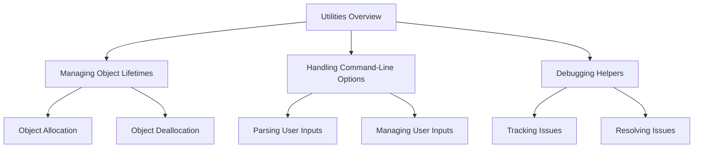

# Utilities Overview

Utilities refer to a collection of helper functions and classes that provide common functionality across the codebase. They are designed to simplify and streamline various operations, such as debugging, data handling, and memory management. Utilities often include classes and functions for managing objects, handling endianness, and implementing data structures like hash tables and caches. These utilities are typically located in the <SwmPath>[src/misc/](src/misc/)</SwmPath> directory and include files like <SwmPath>[src/misc/countedobj.cpp](src/misc/countedobj.cpp)</SwmPath>, <SwmPath>[src/misc/endian_buffer.hpp](src/misc/endian_buffer.hpp)</SwmPath>, and <SwmPath>[src/misc/dbg_helpers.cpp](src/misc/dbg_helpers.cpp)</SwmPath>.

## Managing Object Lifetimes

Utilities include mechanisms for managing object lifetimes, ensuring that objects are properly allocated and deallocated. This is crucial for maintaining the stability and performance of the application.

<SwmSnippet path="/src/misc/countedptr.hpp" line="16">

---

The file <SwmPath>[src/misc/countedptr.hpp](src/misc/countedptr.hpp)</SwmPath> provides one of the standard ways to maintain an object's lifetime.

```c++
 *     One of the standard ways how to maintain object's lifetime.
```

---

</SwmSnippet>

## Handling Command-Line Options

Utilities provide functionality for handling command-line options, making it easier to parse and manage user inputs. This is essential for applications that rely on command-line arguments for configuration and operation.

<SwmSnippet path="/src/misc/getoptdata.cpp" line="35">

---

The file <SwmPath>[src/misc/getoptdata.cpp](src/misc/getoptdata.cpp)</SwmPath> includes logic to handle long command-line options, ensuring they use the entire argument.

```c++
			if (option.longname != nullptr && !strcmp(option.longname, s)) { // Long options always use the entire argument.
```

---

</SwmSnippet>

## Debugging Helpers

Utilities include debugging helpers that assist in tracking and resolving issues within the code. These tools are invaluable for developers when diagnosing and fixing bugs.

<SwmSnippet path="/src/misc/dbg_helpers.cpp" line="143">

---

The file <SwmPath>[src/misc/dbg_helpers.cpp](src/misc/dbg_helpers.cpp)</SwmPath> contains a function that adds a name delimiter for structured names, aiding in debugging.

```c++
		/* add name delimiter (we use structured names) */
```

---

</SwmSnippet>

&nbsp;

*This is an auto-generated document by Swimm AI 🌊 and has not yet been verified by a human*

<SwmMeta version="3.0.0" repo-id="Z2l0aHViJTNBJTNBT3BlblRURC1jb3BpbG90LWRlbW8lM0ElM0Fzd2ltbWlv" repo-name="OpenTTD-copilot-demo"><sup>Powered by [Swimm](/)</sup></SwmMeta>
