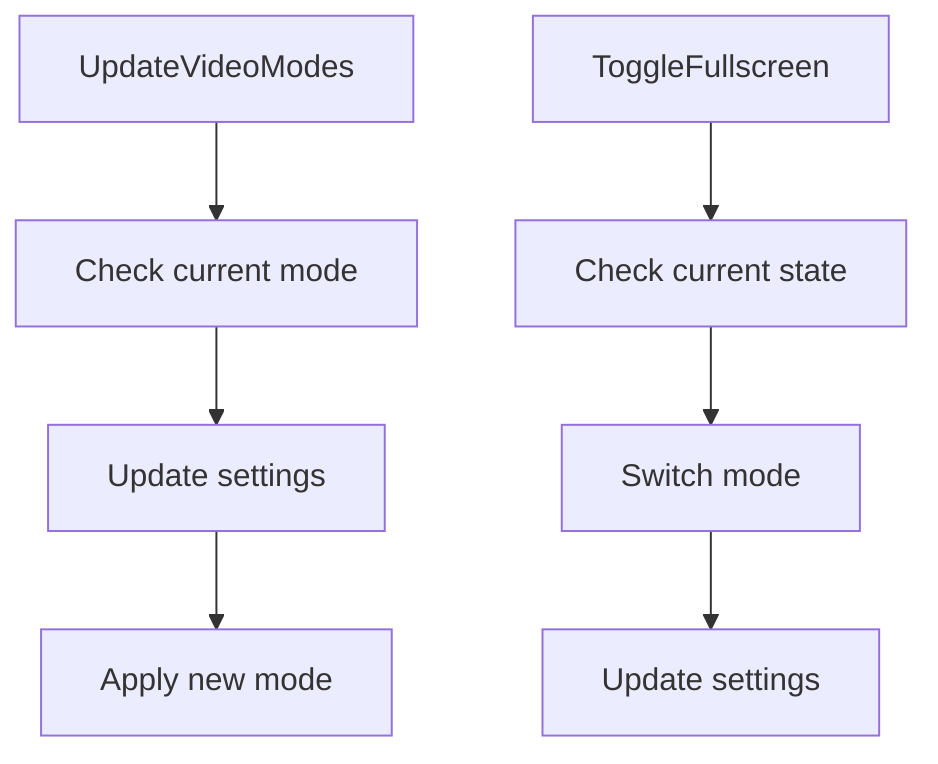

# Video Overview

Video refers to the graphical output and rendering mechanisms used in the game. This document provides an overview of the key functions and methods involved in managing video modes, rendering, and toggling fullscreen mode.

<SwmSnippet path="/src/video/cocoa/cocoa_v.mm" line="345">

---

## Update Video Modes

The function <SwmToken path="src/video/cocoa/cocoa_v.mm" pos="348:4:4" line-data="void VideoDriver_Cocoa::UpdateVideoModes()">`UpdateVideoModes`</SwmToken> is responsible for updating the available video modes based on whether the game is in fullscreen or windowed mode. This ensures that the game can switch between different resolutions and display settings seamlessly.

```objective-c++
/**
 * Update the video mode.
 */
void VideoDriver_Cocoa::UpdateVideoModes()
{
	_resolutions.clear();

	if (this->IsFullscreen()) {
		/* Full screen, there is only one possible resolution. */
		NSSize screen = [ [ this->window screen ] frame ].size;
		_resolutions.emplace_back((uint)screen.width, (uint)screen.height);
	} else {
		/* Windowed; offer a selection of common window sizes up until the
		 * maximum usable screen space. This excludes the menu and dock areas. */
		NSSize maxSize = [ [ NSScreen mainScreen] visibleFrame ].size;
		for (const auto &d : _default_resolutions) {
			if (d.width < maxSize.width && d.height < maxSize.height) _resolutions.push_back(d);
		}
		_resolutions.emplace_back((uint)maxSize.width, (uint)maxSize.height);
	}
}
```

---

</SwmSnippet>

<SwmSnippet path="/src/video/cocoa/cocoa_v.mm" line="304">

---

## Unlock Video Buffer

The function <SwmToken path="src/video/cocoa/cocoa_v.mm" pos="305:4:4" line-data="void VideoDriver_Cocoa::UnlockVideoBuffer()">`UnlockVideoBuffer`</SwmToken> handles unlocking the video buffer, which is essential for rendering the game's graphics.

```objective-c++
/** Unlock video buffer. */
void VideoDriver_Cocoa::UnlockVideoBuffer()
{
	if (_screen.dst_ptr != nullptr) {
		/* Hand video buffer back to the drawing backend. */
		this->ReleaseVideoPointer();
		_screen.dst_ptr = nullptr;
	}

	this->buffer_locked = false;
}
```

---

</SwmSnippet>

<SwmSnippet path="/src/video/opengl.cpp" line="1036">

---

## Render Video Buffer

The method <SwmToken path="src/video/opengl.cpp" pos="1039:4:4" line-data="void OpenGLBackend::Paint()">`Paint`</SwmToken> in the <SwmToken path="src/video/opengl.cpp" pos="8:9:9" line-data="/** @file opengl_v.cpp OpenGL video driver support. */">`OpenGL`</SwmToken> backend is used to render the video buffer to the screen, ensuring that the game's graphics are displayed correctly.

```c++
/**
 * Render video buffer to the screen.
 */
void OpenGLBackend::Paint()
{
	_glClear(GL_COLOR_BUFFER_BIT);

	_glDisable(GL_BLEND);

	/* Blit video buffer to screen. */
	_glActiveTexture(GL_TEXTURE0);
	_glBindTexture(GL_TEXTURE_2D, this->vid_texture);
	_glActiveTexture(GL_TEXTURE1);
	_glBindTexture(GL_TEXTURE_1D, this->pal_texture);
	/* Is the blitter relying on a separate animation buffer? */
	if (BlitterFactory::GetCurrentBlitter()->NeedsAnimationBuffer()) {
		_glActiveTexture(GL_TEXTURE2);
		_glBindTexture(GL_TEXTURE_2D, this->anim_texture);
		_glUseProgram(this->remap_program);
		_glUniform4f(this->remap_sprite_loc, 0.0f, 0.0f, 1.0f, 1.0f);
		_glUniform2f(this->remap_screen_loc, 1.0f, 1.0f);
```

---

</SwmSnippet>

<SwmSnippet path="/src/video/allegro_v.cpp" line="164">

---

## Determine Available Video Mode

The function <SwmToken path="src/video/allegro_v.cpp" pos="164:4:4" line-data="static void GetAvailableVideoMode(uint *w, uint *h)">`GetAvailableVideoMode`</SwmToken> determines the best available video mode for the game, ensuring optimal resolution settings.

```c++
static void GetAvailableVideoMode(uint *w, uint *h)
{
	/* No video modes, so just try it and see where it ends */
	if (_resolutions.empty()) return;

	/* is the wanted mode among the available modes? */
	if (std::find(_resolutions.begin(), _resolutions.end(), Dimension(*w, *h)) != _resolutions.end()) return;

	/* use the closest possible resolution */
	uint best = 0;
	uint delta = Delta(_resolutions[0].width, *w) * Delta(_resolutions[0].height, *h);
	for (uint i = 1; i != _resolutions.size(); ++i) {
		uint newdelta = Delta(_resolutions[i].width, *w) * Delta(_resolutions[i].height, *h);
		if (newdelta < delta) {
			best = i;
			delta = newdelta;
		}
	}
	*w = _resolutions[best].width;
	*h = _resolutions[best].height;
}
```

---

</SwmSnippet>

<SwmSnippet path="/src/video/allegro_v.cpp" line="501">

---

## Toggle Fullscreen Mode

The method <SwmToken path="src/video/allegro_v.cpp" pos="501:4:4" line-data="bool VideoDriver_Allegro::ToggleFullscreen(bool fullscreen)">`ToggleFullscreen`</SwmToken> allows switching between fullscreen and windowed modes, adjusting the video settings accordingly.

```c++
bool VideoDriver_Allegro::ToggleFullscreen(bool fullscreen)
{
	_fullscreen = fullscreen;
	GetVideoModes(); // get the list of available video modes
	if (_resolutions.empty() || !this->ChangeResolution(_cur_resolution.width, _cur_resolution.height)) {
		/* switching resolution failed, put back full_screen to original status */
		_fullscreen ^= true;
		return false;
	}
	return true;
}
```

---

</SwmSnippet>

&nbsp;

*This is an auto-generated document by Swimm AI 🌊 and has not yet been verified by a human*

<SwmMeta version="3.0.0" repo-id="Z2l0aHViJTNBJTNBT3BlblRURC1jb3BpbG90LWRlbW8lM0ElM0Fzd2ltbWlv" repo-name="OpenTTD-copilot-demo"><sup>Powered by [Swimm](/)</sup></SwmMeta>
