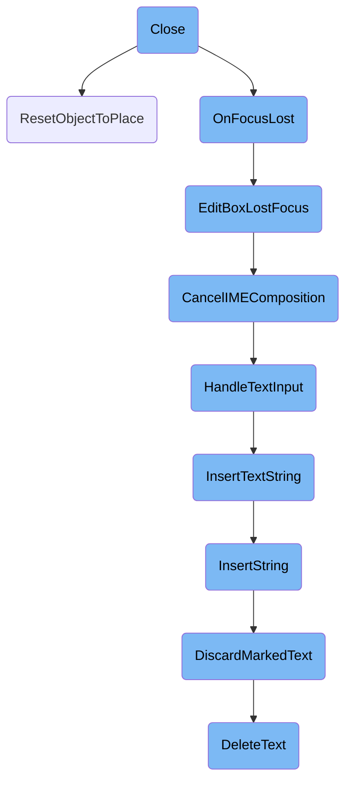
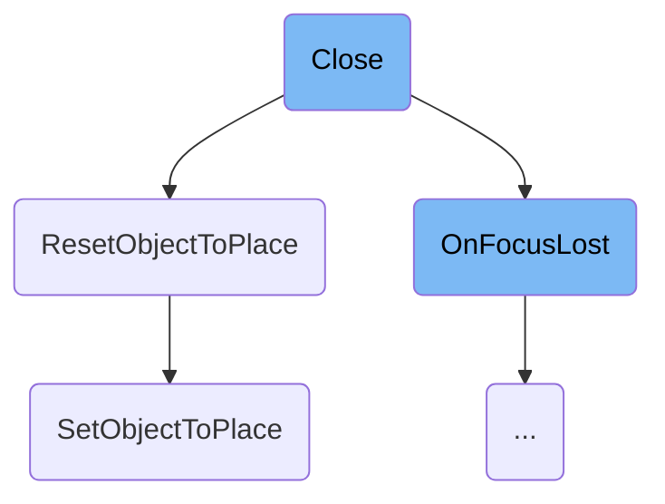
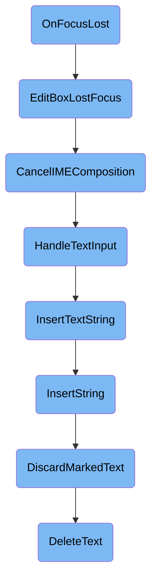
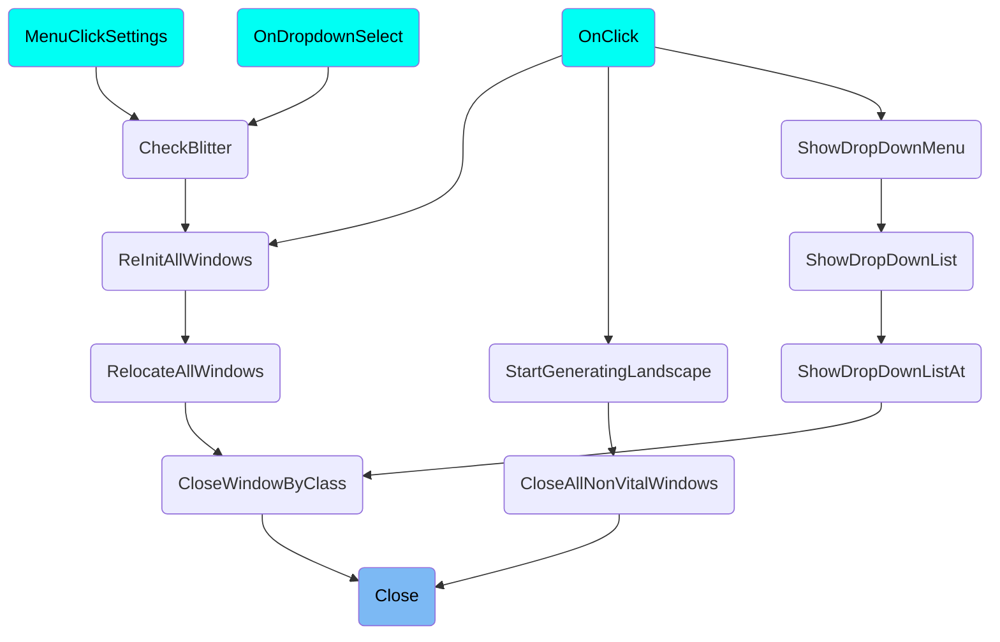

In this document, we will explain the process of closing a window. The process involves hiding the window, resetting various states, and handling focus loss.

The flow starts with the window being hidden and marked for deletion. If the window is the current one, the cursor state is reset. The system then ensures that no actions are attempted on the now-closed window, such as scrolling or accessing query strings. If the window had focus, it triggers a series of steps to handle the loss of focus, including canceling any ongoing text input and updating the text buffer.

Here is a high level diagram of the flow, showing only the most important functions:



# Flow drill down

First, we'll zoom into this section of the flow:



<SwmSnippet path="/src/window.cpp" line="1045">

---

## Handling Window Closure

The <SwmToken path="src/window.cpp" pos="1047:4:4" line-data="void Window::Close([[maybe_unused]] int data)">`Close`</SwmToken> function is responsible for hiding the window and its child windows, marking them for later deletion, and resetting various states related to the window. It ensures that the window is not closed twice, resets the cursor state if the window being closed is the current one, and clears any query strings and focus states associated with the window.

```c++
 * Hide the window and all its child windows, and mark them for a later deletion.
 */
void Window::Close([[maybe_unused]] int data)
{
	/* Don't close twice. */
	if (*this->z_position == nullptr) return;

	*this->z_position = nullptr;

	if (_thd.window_class == this->window_class &&
			_thd.window_number == this->window_number) {
		ResetObjectToPlace();
	}

	/* Prevent Mouseover() from resetting mouse-over coordinates on a non-existing window */
	if (_mouseover_last_w == this) _mouseover_last_w = nullptr;

	/* We can't scroll the window when it's closed. */
	if (_last_scroll_window == this) _last_scroll_window = nullptr;

	/* Make sure we don't try to access non-existing query strings. */
```

---

</SwmSnippet>

<SwmSnippet path="/src/viewport.cpp" line="3494">

---

## Resetting Cursor State

The <SwmToken path="src/viewport.cpp" pos="3495:2:2" line-data="void ResetObjectToPlace()">`ResetObjectToPlace`</SwmToken> function resets the cursor and mouse mode handling back to default. This is done by calling <SwmToken path="src/viewport.cpp" pos="3497:1:1" line-data="	SetObjectToPlace(SPR_CURSOR_MOUSE, PAL_NONE, HT_NONE, WC_MAIN_WINDOW, 0);">`SetObjectToPlace`</SwmToken> with parameters that set the cursor to a normal state and disable any special modes.

```c++
/** Reset the cursor and mouse mode handling back to default (normal cursor, only clicking in windows). */
void ResetObjectToPlace()
{
	SetObjectToPlace(SPR_CURSOR_MOUSE, PAL_NONE, HT_NONE, WC_MAIN_WINDOW, 0);
}
```

---

</SwmSnippet>

<SwmSnippet path="/src/viewport.cpp" line="3439">

---

### Setting Cursor and Mouse Mode

The <SwmToken path="src/viewport.cpp" pos="3447:2:2" line-data="void SetObjectToPlace(CursorID icon, PaletteID pal, HighLightStyle mode, WindowClass window_class, WindowNumber window_num)">`SetObjectToPlace`</SwmToken> function changes the cursor and mouse <SwmToken path="src/viewport.cpp" pos="3440:13:15" line-data=" * Change the cursor and mouse click/drag handling to a mode for performing special operations like tile area selection, object placement, etc.">`click/drag`</SwmToken> handling to a mode for performing special operations like tile area selection or object placement. It handles various states and modes, ensuring that the cursor and mouse behavior are set correctly based on the provided parameters.

```c++
/**
 * Change the cursor and mouse click/drag handling to a mode for performing special operations like tile area selection, object placement, etc.
 * @param icon New shape of the mouse cursor.
 * @param pal Palette to use.
 * @param mode Mode to perform.
 * @param window_class %Window class of the window requesting the mode change.
 * @param window_num Number of the window in its class requesting the mode change.
 */
void SetObjectToPlace(CursorID icon, PaletteID pal, HighLightStyle mode, WindowClass window_class, WindowNumber window_num)
{
	if (_thd.window_class != WC_INVALID) {
		/* Undo clicking on button and drag & drop */
		Window *w = _thd.GetCallbackWnd();
		/* Call the abort function, but set the window class to something
		 * that will never be used to avoid infinite loops. Setting it to
		 * the 'next' window class must not be done because recursion into
		 * this function might in some cases reset the newly set object to
		 * place or not properly reset the original selection. */
		_thd.window_class = WC_INVALID;
		if (w != nullptr) {
			w->OnPlaceObjectAbort();
```

---

</SwmSnippet>

Now, lets zoom into this section of the flow:



<SwmSnippet path="/src/window.cpp" line="513">

---

## <SwmToken path="src/window.cpp" pos="516:4:4" line-data="void Window::OnFocusLost(bool)">`OnFocusLost`</SwmToken>

The <SwmToken path="src/window.cpp" pos="516:4:4" line-data="void Window::OnFocusLost(bool)">`OnFocusLost`</SwmToken> function is triggered when a window loses focus. If the nested focus is an edit box, it calls <SwmToken path="src/window.cpp" pos="518:31:31" line-data="	if (this-&gt;nested_focus != nullptr &amp;&amp; this-&gt;nested_focus-&gt;type == WWT_EDITBOX) VideoDriver::GetInstance()-&gt;EditBoxLostFocus();">`EditBoxLostFocus`</SwmToken> to handle the loss of focus for the edit box.

```c++
/**
 * Called when window loses focus
 */
void Window::OnFocusLost(bool)
{
	if (this->nested_focus != nullptr && this->nested_focus->type == WWT_EDITBOX) VideoDriver::GetInstance()->EditBoxLostFocus();
}
```

---

</SwmSnippet>

<SwmSnippet path="/src/video/win32_v.cpp" line="930">

---

## <SwmToken path="src/video/win32_v.cpp" pos="930:4:4" line-data="void VideoDriver_Win32Base::EditBoxLostFocus()">`EditBoxLostFocus`</SwmToken>

The <SwmToken path="src/video/win32_v.cpp" pos="930:4:4" line-data="void VideoDriver_Win32Base::EditBoxLostFocus()">`EditBoxLostFocus`</SwmToken> function is responsible for handling the loss of focus on an edit box. It cancels any ongoing IME composition and updates the composition and candidate positions.

```c++
void VideoDriver_Win32Base::EditBoxLostFocus()
{
	CancelIMEComposition(this->main_wnd);
	SetCompositionPos(this->main_wnd);
	SetCandidatePos(this->main_wnd);
}
```

---

</SwmSnippet>

<SwmSnippet path="/src/video/win32_v.cpp" line="390">

---

## <SwmToken path="src/video/win32_v.cpp" pos="391:4:4" line-data="static void CancelIMEComposition(HWND hwnd)">`CancelIMEComposition`</SwmToken>

The <SwmToken path="src/video/win32_v.cpp" pos="391:4:4" line-data="static void CancelIMEComposition(HWND hwnd)">`CancelIMEComposition`</SwmToken> function clears the current IME composition string and calls <SwmToken path="src/video/win32_v.cpp" pos="397:1:1" line-data="	HandleTextInput(nullptr, true);">`HandleTextInput`</SwmToken> to clear any marked string from the current edit box.

```c++
/** Clear the current composition string. */
static void CancelIMEComposition(HWND hwnd)
{
	HIMC hIMC = ImmGetContext(hwnd);
	if (hIMC != nullptr) ImmNotifyIME(hIMC, NI_COMPOSITIONSTR, CPS_CANCEL, 0);
	ImmReleaseContext(hwnd, hIMC);
	/* Clear any marked string from the current edit box. */
	HandleTextInput(nullptr, true);
}
```

---

</SwmSnippet>

<SwmSnippet path="/src/window.cpp" line="2642">

---

## <SwmToken path="src/window.cpp" pos="2648:2:2" line-data="void HandleTextInput(const char *str, bool marked, const char *caret, const char *insert_location, const char *replacement_end)">`HandleTextInput`</SwmToken>

The <SwmToken path="src/window.cpp" pos="2648:2:2" line-data="void HandleTextInput(const char *str, bool marked, const char *caret, const char *insert_location, const char *replacement_end)">`HandleTextInput`</SwmToken> function processes text input. If an edit box is in focus, it calls <SwmToken path="src/window.cpp" pos="2652:3:3" line-data="	_focused_window-&gt;InsertTextString(_focused_window-&gt;window_class == WC_CONSOLE ? 0 : _focused_window-&gt;nested_focus-&gt;index, str, marked, caret, insert_location, replacement_end);">`InsertTextString`</SwmToken> to insert the text string into the edit box.

```c++
/**
 * Handle text input.
 * @param str Text string to input.
 * @param marked Is the input a marked composition string from an IME?
 * @param caret Move the caret to this point in the insertion string.
 */
void HandleTextInput(const char *str, bool marked, const char *caret, const char *insert_location, const char *replacement_end)
{
	if (!EditBoxInGlobalFocus()) return;

	_focused_window->InsertTextString(_focused_window->window_class == WC_CONSOLE ? 0 : _focused_window->nested_focus->index, str, marked, caret, insert_location, replacement_end);
}
```

---

</SwmSnippet>

<SwmSnippet path="/src/window.cpp" line="2626">

---

## <SwmToken path="src/window.cpp" pos="2631:10:10" line-data="/* virtual */ void Window::InsertTextString(WidgetID wid, const char *str, bool marked, const char *caret, const char *insert_location, const char *replacement_end)">`InsertTextString`</SwmToken>

The <SwmToken path="src/window.cpp" pos="2631:10:10" line-data="/* virtual */ void Window::InsertTextString(WidgetID wid, const char *str, bool marked, const char *caret, const char *insert_location, const char *replacement_end)">`InsertTextString`</SwmToken> function inserts a text string at the cursor position in the edit box. It updates the text buffer and marks the widget as dirty if the insertion is successful.

```c++
/**
 * Insert a text string at the cursor position into the edit box widget.
 * @param wid Edit box widget.
 * @param str Text string to insert.
 */
/* virtual */ void Window::InsertTextString(WidgetID wid, const char *str, bool marked, const char *caret, const char *insert_location, const char *replacement_end)
{
	QueryString *query = this->GetQueryString(wid);
	if (query == nullptr) return;

	if (query->text.InsertString(str, marked, caret, insert_location, replacement_end) || marked) {
		this->SetWidgetDirty(wid);
		this->OnEditboxChanged(wid);
	}
}
```

---

</SwmSnippet>

<SwmSnippet path="/src/textbuf.cpp" line="149">

---

## <SwmToken path="src/textbuf.cpp" pos="160:4:4" line-data="bool Textbuf::InsertString(const char *str, bool marked, const char *caret, const char *insert_location, const char *replacement_end)">`InsertString`</SwmToken>

The <SwmToken path="src/textbuf.cpp" pos="160:4:4" line-data="bool Textbuf::InsertString(const char *str, bool marked, const char *caret, const char *insert_location, const char *replacement_end)">`InsertString`</SwmToken> function inserts a string into the text buffer. It handles various conditions such as replacing marked text, moving the caret, and updating the buffer's internal state.

```c++
/**
 * Insert a string into the text buffer. If maxwidth of the Textbuf is zero,
 * we don't care about the visual-length but only about the physical
 * length of the string.
 * @param str String to insert.
 * @param marked Replace the currently marked text with the new text.
 * @param caret Move the caret to this point in the insertion string.
 * @param insert_location Position at which to insert the string.
 * @param replacement_end Replace all characters from #insert_location up to this location with the new string.
 * @return True on successful change of Textbuf, or false otherwise.
 */
bool Textbuf::InsertString(const char *str, bool marked, const char *caret, const char *insert_location, const char *replacement_end)
{
	uint16_t insertpos = (marked && this->marklength != 0) ? this->markpos : this->caretpos;
	if (insert_location != nullptr) {
		insertpos = insert_location - this->buf;
		if (insertpos > this->bytes) return false;

		if (replacement_end != nullptr) {
			this->DeleteText(insertpos, replacement_end - this->buf, str == nullptr);
		}
```

---

</SwmSnippet>

<SwmSnippet path="/src/textbuf.cpp" line="274">

---

## <SwmToken path="src/textbuf.cpp" pos="278:4:4" line-data="void Textbuf::DiscardMarkedText(bool update)">`DiscardMarkedText`</SwmToken>

The <SwmToken path="src/textbuf.cpp" pos="278:4:4" line-data="void Textbuf::DiscardMarkedText(bool update)">`DiscardMarkedText`</SwmToken> function discards any marked text in the text buffer and calls <SwmToken path="src/textbuf.cpp" pos="282:3:3" line-data="	this-&gt;DeleteText(this-&gt;markpos, this-&gt;markend, update);">`DeleteText`</SwmToken> to remove the marked text.

```c++
/**
 * Discard any marked text.
 * @param update Set to true if the internal state should be updated.
 */
void Textbuf::DiscardMarkedText(bool update)
{
	if (this->markend == 0) return;

	this->DeleteText(this->markpos, this->markend, update);
	this->markpos = this->markend = this->markxoffs = this->marklength = 0;
}
```

---

</SwmSnippet>

<SwmSnippet path="/src/textbuf.cpp" line="231">

---

## <SwmToken path="src/textbuf.cpp" pos="237:4:4" line-data="void Textbuf::DeleteText(uint16_t from, uint16_t to, bool update)">`DeleteText`</SwmToken>

The <SwmToken path="src/textbuf.cpp" pos="237:4:4" line-data="void Textbuf::DeleteText(uint16_t from, uint16_t to, bool update)">`DeleteText`</SwmToken> function deletes a portion of the text in the text buffer. It updates the buffer's internal state and adjusts the caret and marked text positions accordingly.

```c++
/**
 * Delete a part of the text.
 * @param from Start of the text to delete.
 * @param to End of the text to delete.
 * @param update Set to true if the internal state should be updated.
 */
void Textbuf::DeleteText(uint16_t from, uint16_t to, bool update)
{
	uint c = 0;
	const char *s = this->buf + from;
	while (s < this->buf + to) {
		Utf8Consume(&s);
		c++;
	}

	/* Strip marked characters from buffer. */
	memmove(this->buf + from, this->buf + to, this->bytes - to);
	this->bytes -= to - from;
	this->chars -= c;

	auto fixup = [&](uint16_t &pos) {
```

---

</SwmSnippet>

# Where is this flow used?

This flow is used multiple times in the codebase as represented in the following diagram:

(Note - these are only some of the entry points of this flow)



&nbsp;

*This is an auto-generated document by Swimm AI 🌊 and has not yet been verified by a human*

<SwmMeta version="3.0.0" repo-id="Z2l0aHViJTNBJTNBT3BlblRURC1jb3BpbG90LWRlbW8lM0ElM0Fzd2ltbWlv" repo-name="OpenTTD-copilot-demo"><sup>Powered by [Swimm](/)</sup></SwmMeta>
